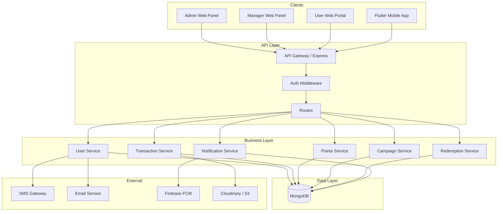

# Fuel Station Loyalty & QR Vehicle Reward System — Design Document

**Version:** 1.0  
**Last Updated:** February 23, 2026  
**Status:** Draft  
**Document Classification:** Internal Use

---

## Document Control

| Version | Date       | Author | Changes                    |
|---------|------------|--------|----------------------------|
| 1.0     | Feb 18, 2026 | Team   | Initial design document    |

---

## 1. Introduction

### 1.1 Purpose

This Design Document describes the **technical design** for the Fuel Station Loyalty & QR Vehicle Reward System. It is derived from and must be read in conjunction with the **Product Requirements Document (PRD):** `Fuel-Loyalty-System-PRD.md`.

- **PRD** = what we build (requirements, behavior, user roles).
- **Design Document** = how we build it (architecture, data model, APIs, security, deployment).

### 1.2 Scope

In scope:

- Backend API (Node.js + Express + MongoDB)
- Data models and database design
- API contracts and request/response patterns
- Authentication, authorization, and security
- Integrations (SMS, Email, Firebase FCM, Cloudinary/S3)
- Caching, performance, and deployment approach

Out of scope (covered elsewhere):

- Detailed UI/UX specifications (see PRD Section 15)
- Flutter app implementation details
- Business rules and campaign logic (see PRD Section 4)

### 1.3 Definitions

| Term | Definition |
|------|------------|
| Pump | A fuel station or store location; unit of management for managers/staff |
| Loyalty ID | Human-readable ID per vehicle (e.g. LOY12345678) |
| Ledger | Immutable record of point credits/debits per user |
| Fleet / Organization | Owner with multiple vehicles; each vehicle has a separate user (driver) and QR |

---

## 2. System Architecture

### 2.1 High-Level Architecture



### 2.2 Technology Stack

| Layer | Technology | Notes |
|-------|------------|--------|
| Runtime | Node.js (LTS) | Backend API |
| Framework | Express.js | REST API, middleware |
| Database | MongoDB | Primary store; replica set for HA |
| Auth | JWT | Access + refresh token pattern |
| File storage | Cloudinary / AWS S3 | Bill photos, receipts (no QR images — QR is frontend-generated from ID) |
| SMS | Twilio / MSG91 / AWS SNS | OTP, alerts |
| Email | SendGrid / AWS SES | Welcome, receipts, notifications |
| Push | Firebase Cloud Messaging | Mobile & web push |
| QR generation | **Frontend only** — free library (e.g. `qrcode`, `qrcode.react`) | Backend returns loyaltyId/vehicleId; frontend generates QR from this ID; no QR storage or expiry on backend |

### 2.3 Backend Architecture (Clean Architecture — MVC Style)

The backend follows a **Controller → Service → Repository → Model** layering (Clean Architecture), with cross-cutting layers.

**Data flow:**

```
Controller Layer    →  receives HTTP request, parses input, calls Service
        ↓
Service Layer       →  business logic, orchestration, calls Repository and external services
        ↓
Repository Layer    →  data access only (CRUD via Mongoose models); no business logic
        ↓
Model (Mongoose)    →  schema definition, document interface
        ↓
MongoDB
```

**Cross-cutting layers:**

| Layer | Purpose |
|-------|--------|
| **Middleware** | Auth (JWT/OTP), RBAC, pump scope, rate limit, upload, error handler |
| **Utils** | Helpers (asyncHandler, ApiResponse, ApiError, logger, date/format) |
| **Validation** | Request body/query validation (e.g. Joi/Zod) before controller or inside controller |
| **Seeder** | Seed data (admin user, system config, sample pumps/rewards) |
| **Config** | DB connection, env-based app config (no business logic) |
| **Constants** | Enums, status values, error codes, magic strings in one place |

**Folder structure (recommended):**

```
src/
├── config/          # DB, app config
├── constants/       # Enums, status, error codes
├── controllers/     # Controller layer (route handlers)
├── middlewares/     # Auth, RBAC, rate limit, upload, error handler
├── models/          # Mongoose models (schemas)
├── repositories/    # Repository layer (data access)
├── services/        # Service layer (business logic)
├── utils/           # Helpers, ApiResponse, logger
├── validation/      # Request validation schemas
├── seeders/         # Seed scripts
├── routes/          # Express routes (wire controller methods)
└── app.js / server.js
```

**Rules:**

- **Controllers** do not access models or DB directly; they call **services** only.
- **Services** contain business logic and call **repositories** for all DB operations; services may call external APIs (SMS, Email, FCM, Cloudinary/S3).
- **Repositories** encapsulate Mongoose operations (find, findOne, create, update, delete, aggregate); one repository per entity (or per aggregate). No business rules in repositories.
- **Models** define schema and static helpers only; no business logic.
- **Validation** can run in middleware (before controller) or at the start of controller; invalid input returns 400 before hitting service.

### 2.4 Request Flow

1. **Client** → HTTP request to Express (routes).
2. **Middleware** → Auth (JWT or OTP), RBAC, validation (if applied), rate limit.
3. **Controller** → Parses input (req.body, req.params, req.query), calls **Service**.
4. **Service** → Business logic, calls **Repository** for DB and external services for integrations.
5. **Repository** → Reads/writes via **Model** (Mongoose) → MongoDB.
6. **Response** → Controller returns JSON with consistent envelope (e.g. `{ success, message, data, meta }`).

Pump-scoping: For Manager/Staff, `req.user` is bound to assigned pump(s); services/repositories filter by `pumpId` where applicable.

---

## 3. Data Model & Database Design

### 3.1 Entity Overview

Design aligns with PRD Section 7 (Database Design) and extends it for:

- **Account types:** Individual vs Organization (fleet); fleet has one owner and multiple vehicle-level users.
- **Registration & referral points:** Config stored at system level; ledger entries for staff/manager points.
- **Campaign ownership:** Campaigns can be created by Admin (global or pump-specific) or by Manager (pump-specific only).

Core entities:

| Entity | Purpose |
|--------|--------|
| Users | All roles (admin, manager, staff, user); referral code for manager/staff; FcmTokens; **fleet owner** has their own account with ID; **fleet drivers** have `ownerId` pointing to owner |
| Vehicles | Per user; loyaltyId (ID for frontend QR generation and backend verification); no QR storage or expiry on backend |
| Organizations | Fleet owner; links owner user to many vehicle-users (optional explicit collection or denormalized) |
| Pumps | Store/location; managerId; timezone, currency |
| Transactions | pumpId, vehicleId (optional if owner QR used), userId (vehicle/driver OR owner if owner QR scanned), operatorId, amount, **liters** (required for fuel), billNumber, **attachments** (bill photo required for fuel) |
| PointsLedger | userId, transactionId/redemptionId, type (credit/debit/expiry/adjustment/refund), points, balanceAfter, expiryDate |
| Campaigns | name, type, multiplier/bonus, start/end, conditions, **pumpIds** (empty = all), **createdBy** (admin vs manager) |
| **Banners** | Offers/promos for user banner section; startTime, endTime (auto-removed when endTime passed); pumpIds (empty = global); createdBy (admin or manager for store) |
| Redemptions | userId, pointsUsed, rewardType, status, approvedBy, usedAtPump |
| Rewards | Catalog of reward types and point cost |
| StaffAssignments | staff userId ↔ pumpId |
| AuditLogs | Action, entityType, entityId, userId, changes, timestamp |

### 3.2 Key Collections (MongoDB)

**Users**

- `_id`, `fullName`, `mobile` (unique), `email`, `passwordHash`, `role` (enum: admin, manager, staff, user)
- `walletSummary`: `{ totalEarned, availablePoints, redeemedPoints, expiredPoints }`
- `referralCode` (unique, for manager/staff)
- `FcmTokens` (array of strings)
- `ownerId` (ObjectId, optional; for fleet driver users — points visibility and fleet-totals)
- `status`, `emailVerified`, `mobileVerified`, `address`, `createdAt`, `updatedAt`, `createdBy`

**Vehicles**

- `_id`, `userId`, `vehicleNumber`, `loyaltyId` (unique), `vehicleType`, `fuelType`
- **No QR storage:** Backend does not store `qrData`, `qrImageURL`, `barcodeImageURL`, or any QR expiry. Frontend generates QR from `loyaltyId` (or vehicleId); the ID in the QR is always the same for verification.
- `status` (active/inactive/suspended)

**Transactions**

- `_id`, `pumpId`, `vehicleId`, `userId`, `operatorId`, `amount`, **`liters`** (required for category Fuel)
- `category` (Fuel, Lubricant, Store, Service), `billNumber` (unique per pump), `paymentMode`
- `pointsEarned`, `campaignId` (optional), `status`
- **`attachments`** (array of file URLs) — **required for Fuel** (bill photo)
- `createdAt`, `updatedAt`

**PointsLedger**

- `_id`, `userId`, `transactionId` (optional), `redemptionId` (optional)
- `type`: credit | debit | expiry | adjustment | refund
- `points` (signed), `balanceAfter`, `expiryDate` (for credits), `reason`, `createdBy`

**Campaigns**

- `_id`, `name`, `type`, `multiplier` / `bonusPoints` / `bonusPercentage`
- `startDate`, `endDate`, `conditions` (minAmount, categories, userSegment, frequencyLimit)
- **`pumpIds`** (array; empty = all pumps; manager-created campaigns have single pumpId)
- **`createdBy`** (userId), **`createdByRole`** (admin | manager)
- `status`: draft | active | paused | expired | cancelled

**Banners**

- `_id`, `title`, `description` (optional), `imageUrl` (optional), `linkUrl` (optional)
- **`startTime`**, **`endTime`** (required; banners are excluded from active list when `endTime` ≤ now — auto-removal at query time or via scheduled job)
- **`pumpIds`** (array; empty = global/show to all; otherwise show only for those stores)
- **`createdBy`** (userId), **`createdByRole`** (admin | manager); manager-created banners must have single pumpId (their store)
- `status` (optional): active | expired
- `createdAt`, `updatedAt`

**SystemConfig** (or embedded in first document)

- Registration points (points to operator when manager/staff registers a user)
- Referral points (points to manager/staff when user self-registers with referral code)
- Fuel points per liter; other category rules (e.g. points per ₹100)

### 3.3 Indexes (Recommended)

- **Users:** `mobile` (unique), `referralCode` (unique), `role`, `ownerId`, `status`
- **Vehicles:** `userId`, `loyaltyId` (unique), `vehicleNumber` (unique)
- **Transactions:** `pumpId`, `vehicleId`, `userId`, `(pumpId, billNumber)` (unique), `createdAt`
- **PointsLedger:** `userId`, `createdAt`, `expiryDate`
- **Campaigns:** `status`, `startDate`, `endDate`, `pumpIds`
- **Banners:** `startTime`, `endTime`, `pumpIds`, `status` (for active-offers query: endTime > now)
- **Redemptions:** `userId`, `status`, `redemptionCode` (unique)

### 3.4 Organization (Fleet) Model

- **Option A:** No separate Organization collection: **owner is a User** (has their own account with `_id` and can have loyaltyId); fleet drivers are Users with `ownerId` set to owner’s `_id`. Owner sees aggregate by querying all users where `ownerId = me`. Each driver has own Vehicles and PointsLedger.
- **Option B:** Organization collection with `ownerId`, `name`; Vehicle or User has `organizationId`. Same ledger per user; owner dashboard aggregates by `organizationId`.

Design choice: **Option A** is sufficient for “one owner, many vehicle-users, each with own QR and points”; owner’s “all total fleet points” = sum of availablePoints (or ledger) for all users where `ownerId = req.user._id`.

**Transaction entry:** When staff scans QR or enters ID:
- **Vehicle/driver QR** (loyaltyId) → resolve to vehicle/driver user → transaction `userId` = vehicle/driver user, `vehicleId` = that vehicle.
- **Owner QR** (owner's userId or loyaltyId) → resolve to owner user → transaction `userId` = owner user, `vehicleId` = null or optional (if vehicle info provided separately).

---

## 4. API Design

### 4.1 Conventions

- **Base path:** `/api`
- **Auth:** Bearer JWT in `Authorization` header for protected routes.
- **Response envelope:** `{ success: boolean, message?: string, data?: T, meta?: { page, limit, total, totalPages } }`
- **Errors:** HTTP status + `{ success: false, message, errors?: [] }`
- **Idempotency:** For POST /transactions and POST /redeem, support `Idempotency-Key` header where needed.

### 4.2 Authentication & Authorization

- **User (customer) login — OTP only:** No password. `POST /api/auth/send-otp` (mobile) → then `POST /api/auth/verify-otp` (mobile, otp) → returns JWT for existing user.
- **Admin / Manager / Staff login — identifier + password:** `POST /api/auth/login` with `identifier` (email, username, phone number, or user ID) and `password` → JWT.
- **Register:** `POST /api/auth/register` 
  - Body: `{ accountType: 'individual' | 'organization', mobile, fullName, email?, referralCode?, vehicle, ownerType?, ownerIdentifier?, owner? }`
  - Supports Individual and Organization (Fleet) registration
  - For organization: `ownerType: 'registered' | 'non-registered'`
  - If registered: searches owner by `ownerIdentifier` (ID or phone)
  - If non-registered: creates owner account + driver account + vehicle
- **OTP:** `POST /api/auth/verify-otp` (registration or user login), `POST /api/auth/resend-otp`.
- **Refresh:** `POST /api/auth/refresh` (refresh token in body or cookie).
- **RBAC:** Middleware checks `req.user.role` and optionally `req.user.pumpId`/assignments; 403 if not allowed.

### 4.3 API Grouping (Logical)

| Group | Examples | Who |
|-------|----------|-----|
| Auth | register, login, verify-otp, resend-otp | Public / User |
| Owner | search owner, add vehicle to fleet, get fleet vehicles | Public (search) / Owner (authenticated) |
| Users | GET/PATCH /users/:id, vehicles, wallet | User (self), Admin |
| Scan | POST /scan/qr, /scan/validate, /scan/redeem | Staff, Manager, Admin |
| Transactions | POST/GET /transactions, calculate-points | Staff, Manager, Admin |
| Wallet | GET wallet, ledger; POST adjust | User, Manager, Admin |
| Redemptions | POST /redeem, GET redemptions; approve/reject | User, Manager, Admin |
| Rewards | GET /rewards | User, Staff |
| Admin | users, pumps, campaigns, points-rules, dashboard | Admin |
| Manager | pump-scoped transactions, wallet adjust, campaigns (pump), redemptions | Manager |
| Staff | create user, create transaction, scan/redeem | Staff |
| Notifications | subscribeToken, my, delete my; send (admin) | User, Admin |
| Banners | GET active banners (user); CRUD (admin global/store; manager store only) | User, Admin, Manager |

### 4.4 Key Endpoints (Design Summary)

- **Registration:** `POST /api/auth/register` — supports Individual and Organization (Fleet) registration:
  - Individual: Creates user + vehicle (no owner)
  - Organization with registered owner: Searches owner by ID/phone, creates driver user linked to owner + vehicle
  - Organization with non-registered owner: Creates owner + driver user + vehicle, links driver to owner
  - Also: `POST /api/admin/users`, `POST /api/manager/users`, `POST /api/staff/users` — on success, if operator is manager/staff, credit registration points (config); if self-register with `referralCode`, credit referral points to that manager/staff.
- **Owner Management:** `GET /api/owner/search` (search owner), `POST /api/owner/vehicles` (add vehicle to fleet), `GET /api/owner/vehicles` (view fleet)
- **Transactions:** `POST /api/transactions` — body must include `liters` for category Fuel; `attachments` (bill photo) required for Fuel. **Identifier** can be:
  - Vehicle/driver's **loyaltyId** → points go to that vehicle/driver's userId.
  - **Owner ID** (fleet owner's userId) → points go to owner's userId (for all vehicles).
- Points calculated: fuel = f(liters); others = f(amount). Validate duplicate (pumpId + billNumber).
- **Scan/validate:** `POST /api/scan/validate` or `POST /api/scan/qr` — body: identifier (loyaltyId for vehicle/driver, **owner ID** for fleet owner, or mobile/vehicleId). Returns user/vehicle info:
  - If loyaltyId → vehicle/driver user (points go to that vehicle/driver).
  - If owner ID → owner user (points go to owner's account).
- **Redemption at pump:** `POST /api/scan/redeem` or `POST /api/manager/redeem` — body: identifier (loyaltyId, **owner ID**, or mobile), `pointsToDeduct`, optional rewardId. Resolve user → deduct from wallet → create Redemption record.
- **Campaigns:** Admin: CRUD campaigns, any pumpIds. Manager: CRUD campaigns with `pumpIds` restricted to their assigned pump(s) only.
- **Notifications:** `POST /api/notifications/subscribeToken`, `GET/DELETE /api/notifications/my`; admin send to all or to userIds (FCM + save to Notification collection per user).
- **Banners:** `GET /api/banners` — active banners for user (filter: startTime ≤ now & endTime > now; optional pumpId). Admin: CRUD at `/api/admin/banners` (global or pumpIds). Manager: CRUD at `/api/manager/banners` (their pump only). Banners past endTime are not returned (auto-removal).

---

## 5. Security Design

- **Authentication:** JWT (RS256 or HS256); short-lived access token; optional refresh token in httpOnly cookie.
- **Passwords:** Bcrypt/Argon2; no plain text.
- **QR/verification:** QR is generated on frontend from loyaltyId (same ID for verification). Backend only validates the ID from scan or manual entry; no QR payload signing/expiry on backend.
- **Authorization:** Role-based (admin, manager, staff, user); pump-scoped for manager/staff (only assigned pumps).
- **Input:** Validation (e.g. Joi/Zod); sanitization; no raw MongoDB operator injection.
- **Rate limiting:** Per IP and per user (in-memory or simple store); stricter on auth and OTP endpoints.
- **Audit:** Log sensitive actions (user create, wallet adjust, redemption, campaign create) to AuditLogs with userId, entity, before/after.

---

## 6. Integrations

- **SMS:** Used for OTP and optional alerts; provider-agnostic interface; retries and logging.
- **Email:** Welcome, receipts, redemption confirmations; template engine; track failures.
- **Firebase FCM:** Service account server-side; store FCM tokens per user; send to topic “all” or to specific tokens; persist notifications in DB for in-app list.
- **Cloudinary/S3:** Upload bill photos, receipts; return stable URLs; use in Transactions.attachments. No QR image upload — QR is generated on frontend from ID.

---

## 7. Caching & Performance

- **Caching:** Redis is not used in the current design. Session/token blocklist and rate limits can use in-memory store or MongoDB; optional future: Redis for campaign/rules cache.
- **DB:** Indexes as in Section 3.3; avoid full collection scans; use projection to limit fields.
- **Targets:** API p95 < 2s; transaction processing < 3s (PRD).

---

## 8. Deployment & Operations

- **Runtime:** Node.js on VM/container (e.g. AWS EC2, ECS, or similar).
- **Database:** MongoDB Atlas (or self-hosted replica set); backups and point-in-time recovery per PRD.
- **File storage:** Cloudinary or S3 with correct IAM and CORS.
- **Environment:** `NODE_ENV`, `PORT`, `MONGODB_URI`, `JWT_SECRET`, `JWT_EXPIRY`, Cloudinary/S3 keys, SMS/Email keys, Firebase service account path (or JSON).
- **Logging:** Structured logs (e.g. JSON); log level by env; errors with stack and requestId.
- **Monitoring:** Health check endpoint; metrics for latency and errors; alerts on high error rate or slow responses (per PRD).

---

## 9. Design Decisions Summary

| Area | Decision | Rationale |
|------|----------|-----------|
| Fuel points | Based on **liters**; other categories on amount | PRD: fuel points per liter; flexibility for other categories |
| Bill photo | Required for Fuel transactions; stored in `attachments` | Proof of purchase; PRD |
| Registration/Referral points | Stored in SystemConfig; credited to operator/referrer via PointsLedger | Admin-configurable; separate from fuel points |
| Fleet | Owner = user (has own ID/QR); drivers = users with `ownerId`; each driver has own vehicles/QR/points; transactions can use vehicle loyaltyId OR owner ID | Simple; owner aggregates by `ownerId` for “all total fleet points”; owner QR usable for transactions |
| Campaigns | Admin: any pumps; Manager: only their pump(s) | PRD: manager can set special campaigns for their store |
| Redemption at pump | Deduct by user identified via QR/loyaltyId/mobile | PRD: staff/manager/admin scan or type ID, then deduct |
| Banners | Admin: any scope; Manager: their pump only; active = startTime ≤ now & endTime > now (auto-removed when end time reached) | PRD: user banner section; admin/manager create; auto-removal |

---

## 10. References

- **Product Requirements Document:** `Fuel-Loyalty-System-PRD.md` (Sections 1–18)
- **Database Design (PRD):** Section 7 and 7.1 (ERD, collections)
- **API Endpoints (PRD):** Section 4 (functional requirements) and Section 8 (API details)
- **Integration (PRD):** Section 14 (SMS, Email, Firebase, Cloud Storage)

---

*This design document should be updated when the PRD changes or when technical decisions are revised.*
