# Product Requirements Document (PRD)

# Fuel Station Loyalty & QR Vehicle Reward System

**Version:** 2.0 (Comprehensive)  
**Last Updated:** February 17, 2026  
**Owner:** Backend & Web Team  
**Status:** In Development  
**Document Classification:** Internal Use

---

## Document Control

| Version | Date | Author | Changes |
|---------|------|--------|---------|
| 1.0 | Initial | Team | Initial PRD |
| 2.0 | Feb 17, 2026 | Team | Comprehensive expansion |

---

# 1. Executive Summary

## 1.1 Overview

This system enables fuel stations to operate a comprehensive digital loyalty program where:

- Users register with personal and vehicle details (registration can be done by admin/user/manager)
- A unique QR code / Barcode / Loyalty ID is generated per vehicle
- QR sticker is affixed to the vehicle for quick identification
- At the pump, staff scan QR / enter mobile number / loyalty ID
- Points are credited based on purchase amount with configurable rules
- Users can redeem accumulated points for various rewards
- Multi-pump management with centralized control

## 1.2 Target Users

- **End Customers:** Vehicle owners seeking fuel discounts and rewards
- **Fuel Station Operators:** Multi-pump fuel station chains
- **Station Managers:** On-site pump managers
- **Staff:** Pump operators and cashiers

## 1.3 Platforms Included

- **Admin Web Panel:** Centralized management dashboard
- **Manager Web Panel:** Pump-level management interface
- **User Web Portal:** Customer self-service portal
- **Flutter Mobile App:** iOS and Android mobile application
- **Backend API:** Node.js + Express + MongoDB RESTful API
- **QR Code:** Frontend generates QR from loyalty ID (returned by backend); backend verifies ID only; no QR storage or expiry

## 1.4 Key Value Propositions

**For Customers:**
- Earn points on every fuel purchase
- Easy redemption process
- Track transaction history
- Multiple vehicles per account
- Transparent point balance and expiry

**For Fuel Stations:**
- Increased customer retention
- Data-driven insights
- Reduced operational overhead
- Fraud prevention mechanisms
- Scalable multi-pump support

## 1.5 System Design Diagrams

This PRD includes comprehensive system design diagrams located in **Section 6.5** covering:
- System Architecture Overview
- User Registration Flow
- Transaction Processing Flow
- Points Calculation Engine
- Redemption Flow
- Database Entity Relationship Diagram
- API Request Flow
- Wallet & Points Management Flow
- Deployment Architecture
- User Journey Flow
- Fraud Detection Flow
- Campaign Application Flow
- System Components Interaction

**Note:** All diagrams are in Mermaid format and can be rendered in Markdown viewers that support Mermaid (GitHub, GitLab, VS Code with Mermaid extension, etc.)

---

# 2. Objectives

## 2.1 Business Objectives

### Primary Goals
- **Increase Customer Retention:** Target 30% improvement in repeat customer visits
- **Encourage Repeat Purchases:** Drive higher frequency of fuel purchases through rewards
- **Centralized Management:** Enable multi-pump loyalty program management from single dashboard
- **Customer Behavior Analytics:** Track and analyze customer spending patterns
- **Cost Reduction:** Reduce manual loyalty program management overhead
- **Competitive Advantage:** Differentiate through digital-first loyalty experience

### Success Metrics
- Customer retention rate increase
- Average transaction frequency per customer
- Points redemption rate
- Customer acquisition cost
- Program ROI

## 2.2 Technical Objectives

### Core Technical Goals
- **QR-based Vehicle Identification:** QR code generated on frontend from loyalty ID (returned by backend); backend verifies ID only; no QR storage or expiry on backend
- **Configurable Points Engine:** Flexible rules engine for points calculation
- **Fraud-Resistant Transactions:** Multi-layer fraud detection and prevention
- **High Availability:** 99%+ uptime with minimal downtime
- **Scalability:** Support 1M+ users and 10K+ transactions/day per pump
- **Performance:** Sub-3 second transaction processing
- **Data Integrity:** Immutable ledger system for audit compliance

### Technical Success Criteria
- API response time < 2 seconds (95th percentile)
- Zero data loss in transaction processing
- 99.9% transaction success rate
- Support for horizontal scaling
- Comprehensive audit trail

## 2.3 User Experience Objectives

- **Intuitive Interface:** Minimal learning curve for all user types
- **Mobile-First Design:** Optimized for mobile devices
- **Accessibility:** WCAG 2.1 AA compliance
- **Offline Capability:** Basic functionality available offline (future)
- **Multi-language Support:** Support for regional languages (future)

---

# 3. User Roles & Permissions (RBAC)

## 3.1 Super Admin

### Permissions
- **Pump Management:**
  - Create, edit, delete pumps
  - Assign managers to pumps
  - Configure pump-specific settings
  - View all pump data

- **User Management:**
  - Create/manage managers
  - Create/manage staff accounts
  - Block/unblock users
  - Reset passwords
  - View all user data

- **Configuration:**
  - Configure point calculation rules
  - Set expiry rules and duration
  - Configure campaign parameters
  - Set system-wide settings
  - Manage reward catalog

- **Analytics & Reports:**
  - View global analytics dashboard
  - Generate system-wide reports
  - Export data
  - View audit logs

- **System Administration:**
  - Manage system integrations
  - Configure notifications
  - Manage API keys
  - System backup and restore

### Access Level
- Full system access
- All pumps and users
- System configuration

## 3.2 Manager (Pump Level)

### Permissions
- **Transaction Management:**
  - View all pump transactions
  - View transaction history
  - Filter and search transactions
  - Export transaction reports

- **Points Management:**
  - Credit points manually (with approval workflow)
  - View points ledger
  - Approve manual credit requests
  - Adjust points (with reason and audit log)

- **Redemption Management:**
  - Approve/reject redemption requests
  - View redemption history
  - Process redemptions at pump

- **Staff Management:**
  - Create/edit staff accounts
  - Assign staff to shifts
  - View staff activity logs
  - Deactivate staff accounts

- **Reports:**
  - Daily/weekly/monthly transaction summaries
  - Points issued reports
  - Redemption reports
  - Staff performance reports

- **QR Operations:**
  - Access QR scanning interface
  - Manual transaction entry
  - Vehicle lookup
- **User Registration:**
  - Register users at pump; manager receives **registration points** (admin-configurable)
  - Manager has a **referral code** for self-registrations (referral points)
- **Redemption at pump:** Identify user by QR scan or loyalty ID/mobile; deduct points (coins) spent

- **Campaign Management (store-specific):**
  - Create and manage **special campaigns** for **their specific store (pump)** only
  - Set campaign type, dates, multipliers, and conditions for that pump
  - Campaigns created by Manager apply only to transactions at their pump

### Access Level
- Pump-specific access only
- Cannot modify system settings
- Cannot access other pumps

## 3.3 Staff (Pump Operator)

### Permissions
- **Transaction Entry:**
  - Scan QR code
  - Enter loyalty ID manually
  - Enter mobile number for lookup
  - Add transaction details (including **bill photo** for fuel purchases)
  - Credit points automatically (fuel points based on liters)
- **User Registration:**
  - Register users at pump; staff receives **registration points** (admin-configurable)
  - Staff has a **referral code** for self-registrations (referral points)

- **Vehicle Lookup:**
  - Search by loyalty ID
  - Search by mobile number
  - Search by vehicle number
  - View customer details

- **View Only:**
  - View transaction history (own entries)
  - View customer wallet balance
  - View active campaigns
- **Redemption at pump:** Identify user by QR scan or loyalty ID/mobile; deduct points (coins) spent for redemption

### Access Level
- Transaction entry only
- No modification permissions
- No access to reports or settings
- Pump-specific access

## 3.4 User (Customer)

### Permissions
- **Account Management:**
  - Register account (or via admin/manager)
  - Update profile information
  - Change password
  - Update contact details

- **Vehicle Management:**
  - Add vehicles
  - Edit vehicle details
  - Remove vehicles
  - View vehicle QR codes
  - Download/print QR stickers

- **Wallet & Points:**
  - View wallet balance
  - View available points
  - View point expiry dates
  - View points ledger/history

- **Transactions:**
  - View transaction history
  - Filter transactions by date/amount
  - Download transaction receipts
  - View transaction details

- **Redemptions:**
  - Request redemption
  - View redemption history
  - Track redemption status
  - Cancel pending redemptions

- **Campaigns:**
  - View active campaigns
  - View campaign eligibility
  - View campaign history

- **Banners / Offers:**
  - View **banner section** showing all active offers (by store or global)
  - Banners with end time are **removed automatically** when the end time is reached

### Access Level
- Own account only
- Read-only access to system data
- No administrative permissions

## 3.5 Permission Matrix

| Feature | Super Admin | Manager | Staff | User |
|---------|------------|---------|-------|------|
| Create Pumps | ✅ | ❌ | ❌ | ❌ |
| Create Managers | ✅ | ❌ | ❌ | ❌ |
| Create Staff | ✅ | ✅ | ❌ | ❌ |
| Create Users | ✅ | ✅ | ✅ | ✅ (Self) |
| View All Transactions | ✅ | ✅ (Pump) | ❌ | ✅ (Own) |
| Add Transaction | ✅ | ✅ | ✅ | ❌ |
| Manual Points Credit | ✅ | ✅ (Approval) | ❌ | ❌ |
| Approve Redemptions | ✅ | ✅ | ❌ | ❌ |
| Process redemption at pump (scan QR/ID, deduct points) | ✅ | ✅ | ✅ | ❌ |
| Configure Rules | ✅ | ❌ | ❌ | ❌ |
| View Analytics | ✅ | ✅ (Pump) | ❌ | ❌ |
| Manage Campaigns | ✅ (All) | ✅ (Store/Pump only) | ❌ | ❌ |
| Manage Banners / Offers | ✅ (All) | ✅ (Store/Pump only) | ❌ | ❌ |

---

# 4. Functional Requirements

---

# 4. Functional Requirements

## 4.1 Registration Module

### 4.1.1 Account Types

User registration supports two types of accounts:

#### 1. Individual Account
- Single user (customer) with one or more vehicles
- Each vehicle has its own QR code, loyalty ID, and wallet linkage
- User sees their own points and transaction history per vehicle

#### 2. Organization Account (Fleet / Commercial)
- **One owner** (organization/fleet owner)
- **Owner has their own separate ID:** The fleet owner gets a **separate user account** with their **own ID** (and loyaltyId if needed). This ID represents all vehicles they own.
- Owner has **multiple vehicles** (e.g. 10 trucks)
- **Different user per vehicle/driver:** For each vehicle there is a **separate user (account)** — tied to that **specific driver** and that **specific vehicle**. So 10 trucks = **10 different users** (10 different accounts).
- **Different QR per vehicle:** Each of these users has its **own unique QR code** and **own loyalty ID**. So 10 trucks → **10 different QR codes** and **10 different user accounts** (one per driver+vehicle).
- **Owner QR:** The fleet owner also has their **own QR code** (generated from their owner ID) that can be used for transactions.
- **Each per-vehicle user has:**
  - **Vehicle details:** Vehicle number, type, fuel type, etc.
  - **Driver details:** Driver name, contact (for that vehicle)
  - **Owner details:** Linked to the same organization/owner (via `ownerId` field)
- **Transaction entry:** When adding a purchase/transaction, staff can scan/enter:
  - **Vehicle/driver QR** (their loyaltyId) → points credited to that vehicle/driver's account
  - **OR owner QR** (owner's ID) → points credited to the owner's account (for all vehicles)
- **Points visibility:**
  - **Driver (that vehicle’s user):** Sees that vehicle’s points (and that vehicle’s total) **and the all total fleet points** (sum across all vehicles in the organization).
  - **Owner:** Sees **all total fleet points** (sum across all vehicles) and **per-vehicle (per-truck) points** for every vehicle in the fleet.

### 4.1.2 User Registration

#### Registration Methods
1. **Self-Registration:** User registers via web portal or mobile app (optional **referral code** for Manager/Staff referral points — see 4.1.4)
2. **Admin Registration:** Admin creates user account
3. **Manager/Staff Registration:** Manager or Staff creates user account at pump (registration points to operator — see 4.1.3)

#### Required Fields
- **Full Name:** String, 2-100 characters, required
- **Mobile Number:** 10-digit Indian mobile number, OTP verified, unique, required
- **Email:** Valid email format, optional, unique if provided
- **Address:** String, optional
  - Street address
  - City
  - State
  - Pincode

#### Vehicle Details (Required at Registration)
- **Vehicle Number:** String, unique, required (e.g., "MH12AB1234")
- **Vehicle Type:** Enum, required
  - Two-Wheeler
  - Three-Wheeler
  - Four-Wheeler
  - Commercial Vehicle
- **Fuel Type:** Enum, required
  - Petrol
  - Diesel
  - CNG
  - Electric (future)
- **Vehicle Brand:** String, optional (e.g., "Maruti", "Honda")
- **Vehicle Model:** String, optional
- **Year of Manufacture:** Number, optional

#### Validation Rules
- Mobile number must be unique across system
- Vehicle number must be unique per user
- OTP verification required for mobile number
- Email verification optional but recommended
- Minimum age requirement: 18 years (if DOB collected)

#### System Output
Upon successful registration:
- **userId:** Unique user identifier
- **vehicleId:** Unique vehicle identifier
- **loyaltyId:** Unique loyalty ID (format: "LOY" + 8-digit number) — **this ID is used for QR verification and is always the same for this vehicle**
- **Wallet:** Initialized with zero balance
- **Welcome SMS:** Sent to registered mobile number
- **Welcome Email:** Sent if email provided

**QR code:** The backend **does not generate or store** QR code images. After registration, the backend returns the **loyaltyId** (and vehicleId/userId as needed). The **frontend** generates the QR code from this ID. For scan/verification, the QR content is this **same ID**; the backend only needs the ID to validate and look up the user/vehicle. No QR images or QR metadata are saved in the backend.

#### Registration Flow

**Individual Registration:**
1. User selects "Individual" account type
2. User enters personal details (fullName, mobile, email)
3. System validates mobile number format
4. OTP sent to mobile number
5. User enters OTP
6. System verifies OTP
7. User enters vehicle details (vehicleNumber, vehicleType, fuelType, etc.)
8. Optional: User uploads photos (profilePhoto, driverPhoto, rcPhoto)
9. System validates vehicle number uniqueness
10. System creates user account and vehicle
11. System generates loyalty ID (and vehicleId)
12. Wallet initialized
13. Backend returns userId, vehicleId, loyaltyId to frontend; **frontend generates QR code from this ID** (backend does not store QR)
14. Registration confirmation sent (SMS/Email)
15. User redirected to dashboard

**Organization (Fleet) Registration:**

**Option A: Registered Owner**
1. User selects "Organization" account type
2. User selects "Registered Owner"
3. User enters owner identifier (owner ID or phone number)
4. System searches for owner by identifier
5. If owner found, system displays owner details
6. User enters driver details (mobile, fullName, email)
7. System validates driver mobile number format
8. OTP sent to driver mobile number
9. User enters OTP
10. System verifies OTP
11. User enters vehicle details (vehicleNumber, vehicleType, fuelType, etc.)
12. Optional: User uploads photos (profilePhoto, driverPhoto, rcPhoto)
13. System creates driver user account linked to owner (ownerId = owner's _id)
14. System creates vehicle for driver
15. System generates loyalty ID (and vehicleId)
16. Wallet initialized for driver
17. Backend returns userId, vehicleId, loyaltyId, ownerId to frontend
18. Registration confirmation sent (SMS/Email)
19. User redirected to dashboard

**Option B: Non-Registered Owner**
1. User selects "Organization" account type
2. User selects "Non-Registered Owner"
3. User enters owner details (fullName, mobile, email, address)
4. System validates owner mobile number format
5. OTP sent to owner mobile number (if owner mobile provided)
6. User enters OTP (if applicable)
7. System verifies OTP
8. System creates owner account
9. User enters driver details (mobile, fullName, email)
10. System validates driver mobile number format
11. OTP sent to driver mobile number
12. User enters OTP
13. System verifies OTP
14. User enters vehicle details (vehicleNumber, vehicleType, fuelType, etc.)
15. Optional: User uploads photos (profilePhoto, driverPhoto, rcPhoto)
16. System creates driver user account linked to owner (ownerId = owner's _id)
17. System creates vehicle for driver
18. System generates loyalty ID (and vehicleId)
19. Wallet initialized for driver
20. Backend returns userId, vehicleId, loyaltyId, ownerId to frontend
21. Registration confirmation sent (SMS/Email)
22. User redirected to dashboard

**Owner Management:**
- Owners can search for their account: `GET /api/owner/search?identifier=phone_or_id`
- Owners can add vehicles to their fleet: `POST /api/owner/vehicles` (authenticated)
- Owners can view all vehicles in their fleet: `GET /api/owner/vehicles` (authenticated)

#### API Endpoints
- `POST /api/auth/register` - Self-registration
  - Body: `{ accountType: 'individual' | 'organization', mobile, fullName, email?, referralCode?, vehicle, ownerType?, ownerIdentifier?, owner? }`
  - For organization: `ownerType: 'registered' | 'non-registered'`
  - If registered: `ownerIdentifier` (owner ID or phone) required
  - If non-registered: `owner` object (fullName, mobile, email?, address?) required
- `GET /api/owner/search?identifier=phone_or_id` - Search owner (for registration flow)
- `POST /api/owner/vehicles` - Owner adds vehicle to fleet (authenticated owner)
- `GET /api/owner/vehicles` - Owner views fleet vehicles (authenticated owner)
- `POST /api/admin/users` - Admin creates user
- `POST /api/manager/users` - Manager creates user
- `POST /api/staff/users` - Staff creates user
- **User login (OTP):** `POST /api/auth/send-otp` - Send OTP to mobile (for login); then `POST /api/auth/verify-otp` - Submit mobile + OTP to get JWT (no password).
- **Admin/Manager/Staff login:** `POST /api/auth/login` - Submit identifier (email/username/phone/id) + password to get JWT.
- `POST /api/auth/verify-otp` - OTP verification (registration or user login; returns JWT for existing user)
- `POST /api/auth/resend-otp` - Resend OTP

### 4.1.3 Manager/Staff Registration Points

When a **Manager or Staff** registers a user (at pump or via panel), the **operator who performed the registration receives points**.

- **Configurable by Admin:** The number of points awarded per registration is set by the Super Admin (e.g. 50 points per user registered).
- **Credited to:** The Manager or Staff user who created the registration.
- **Separate from fuel points:** This is a **registration incentive** only; the fuel point system is different and based on liters (see 4.3).
- **Audit:** System records which operator registered which user for points attribution.

### 4.1.4 Referral Point System (Manager/Staff Only)

When a **user self-registers** (web or app), they may enter a **referral code**. The **Manager or Staff** who owns that referral code receives points.

- **Referral code:** Each Manager/Staff has a unique referral code (e.g. generated or assigned by admin). User enters this at self-registration.
- **Points to Manager/Staff:** On successful self-registration with a valid referral code, the linked Manager/Staff is credited with referral points.
- **Configurable by Admin:** Referral points per sign-up are configurable (e.g. 25 points per referred user).
- **Only for Manager/Staff:** This referral point system applies only to Manager and Staff roles; it does not apply to end-user-to-user referral.
- **Separate from fuel points:** Referral points are independent of the fuel point system (which is based on liters).

### 4.1.5 Login / Authentication Methods

Login behavior differs by role:

#### User (Customer) — OTP Login
- **Users (end customers)** log in using **OTP only** (no password).
- Flow:
  1. User enters **mobile number**.
  2. System sends OTP to that mobile (SMS).
  3. User submits **mobile + OTP** (e.g. `POST /api/auth/verify-otp` or login-with-OTP endpoint).
  4. System verifies OTP and returns JWT (and refresh token if used).
- Optional: "Send OTP" step can be a dedicated endpoint (e.g. `POST /api/auth/send-otp`) before verify.

#### Admin, Manager, Staff — Identifier + Password Login
- **Admin, Manager, and Staff** log in using an **identifier** and **password**.
- **Identifier** can be any one of: **user ID**, **email**, **username**, or **phone number** (system looks up the user by the provided value).
- **Password** is required (set during account creation or reset by admin).
- Flow:
  1. User enters identifier (email / username / phone number / id) and password.
  2. System validates credentials and returns JWT (and refresh token if used).

---

## 4.2 QR Code Handling & Verification

### 4.2.1 QR Code: Frontend Generation, Backend Verification Only

- **QR code is handled by the frontend.** The backend **does not generate or store** QR code images.
- **After registration,** the backend returns the **loyaltyId** (and vehicleId / userId as needed). The **frontend** uses this ID to generate the QR code (e.g. with a free client-side library). The **ID in the QR is always the same** for that vehicle (the loyaltyId or the same identifier agreed for verification).
- **Backend does not save** QR images, QR payload, or barcode images. Backend only needs to store the **loyaltyId** (and vehicle/user identifiers) for **verification**: when a QR is scanned, the scanner gets the ID from the QR and sends it to the backend; the backend validates the ID and returns the associated user/vehicle.
- **No QR code expiry system:** There is no expiry or refresh for QR codes. The same ID is used for the lifetime of the vehicle; no "QR expired" or "refresh QR" flow.

### 4.2.2 QR Content for Verification

- The QR code **content** is the **verification ID**:
  - For **vehicle/driver:** **loyaltyId** (or vehicleId) — always the same for that vehicle.
  - For **fleet owner:** **owner ID** (owner's userId or loyaltyId) — always the same for that owner.
- When staff scan the QR at the pump (or for redemption), the app reads this ID and sends it to the backend (e.g. `POST /api/scan/validate` or `POST /api/scan/qr`) with the ID. The backend:
  - Looks up by **loyaltyId** → finds vehicle/driver user → transaction points go to that vehicle/driver.
  - Looks up by **owner ID** → finds fleet owner user → transaction points go to the owner's account (for all vehicles).

### 4.2.3 Backend Responsibility

- Store and expose **loyaltyId** (and vehicleId, userId) per vehicle so the frontend can generate the QR after registration or when viewing the vehicle.
- **Verification endpoint:** Accept the ID from the scanner (from QR or manual entry) and validate it; return user/vehicle info for the flow (transaction, redemption). No QR image storage or QR expiry logic.

### 4.2.4 API Endpoints (QR-Related)

- **For frontend to get ID for QR:** Return loyaltyId (and vehicleId/userId) in registration response and in `GET /api/users/:userId/vehicles` or `GET /api/users/:userId/vehicles/:vehicleId` so the frontend can generate the QR from this ID.
- **Verification:** `POST /api/scan/validate` or `POST /api/scan/qr` — request body contains the **ID** (e.g. loyaltyId, vehicleId, or **owner ID**) read from the QR or entered manually; backend validates and returns user/vehicle info:
  - If ID is a **loyaltyId** → returns vehicle/driver user and vehicle info (points go to that vehicle/driver).
  - If ID is an **owner ID** → returns owner user info (points go to owner's account for all vehicles).
- **Removed:** No endpoints for "get QR image", "get barcode", or "refresh QR" — frontend generates QR from ID; no QR expiry.

---

## 4.3 Transaction & Points Engine

### 4.3.1 Transaction Inputs

#### Required Fields
- **Pump ID:** ObjectId, required
- **Operator ID:** ObjectId (staff/admin), required
- **Vehicle Identifier:** One of:
  - Vehicle ID (from QR scan)
  - Loyalty ID (manual entry) — vehicle/driver's loyaltyId
  - **Owner ID** (from QR scan or manual entry) — fleet owner's ID (for fleet transactions)
  - Mobile Number (lookup)
- **Fuel Amount:** Number, required, minimum ₹100
- **Fuel Liters:** Number, **required for fuel transactions** — used as the basis for fuel point calculation (see 4.3.2)
- **Item Category:** Enum, required
  - Fuel
  - Lubricant
  - Store Items
  - Service
- **Bill Number:** String, required, unique per pump
- **Payment Mode:** Enum, required
  - Cash
  - Card
  - UPI
  - Wallet
- **Transaction Date:** DateTime, default: current timestamp

#### Optional Fields
- **Discount Amount:** Number, if any discount applied
- **Notes:** String, additional transaction notes

#### Required for Fuel Purchase
- **Bill Photo:** Required when Manager, Staff, or User adds a fuel purchase. One or more images of the bill/receipt must be uploaded. Stored as **Attachments** (array of file URLs). Ensures proof of purchase for fuel transactions.

#### Validation Rules
- Bill number must be unique per pump
- Amount must be positive number
- Minimum transaction amount: ₹100
- Vehicle must be active
- Pump must be active
- Operator must have permission

### 4.3.2 Points Calculation Logic

**Important:** The **fuel point system** is **based on liters** (fuel volume). Registration points and referral points (Manager/Staff) are separate and configurable by admin (see 4.1.3, 4.1.4).

#### Fuel Points (Liter-Based)

For **Fuel** category transactions, points are calculated from **liters** (not amount):

- **Admin-configurable:** e.g. X points per liter (e.g. 1 point per liter, or 1 point per 2 liters).
- **Formula (fuel):** `fuelPoints = liters × pointsPerLiter × campaignMultiplier` (with floor/cap as configured).
- **Liters** is required for fuel transactions; bill photo is also required for fuel purchase entry.

#### Other Categories (Amount-Based)

For **Lubricant**, **Store**, **Service**, points may remain **amount-based** (e.g. per ₹100):

- 2 points per ₹100 spent on lubricants
- 3 points per ₹100 spent on store items
- 1.5 points per ₹100 for service (examples; admin-configurable)

#### Admin-Configurable Rules

**Fuel (liter-based) rule example:**
- 1 point per liter of fuel (or per N liters)
- Minimum liters per transaction (if any)
- Maximum points per fuel transaction (cap)

**Amount-based rule examples (non-fuel):**
- 2 points per ₹100 spent on lubricants
- 3 points per ₹100 spent on store items

#### Points Calculation Formula

```javascript
// For FUEL category: liter-based
if (category === 'Fuel') {
  basePoints = liters * pointsPerLiter  // liters required; configurable rate
} else {
  // Lubricant, Store, Service: amount-based
  basePoints = Math.floor(amount / baseAmount)
}

// Category multiplier (if used)
categoryMultiplier = getCategoryMultiplier(category)

// Campaign multiplier (if applicable)
campaignMultiplier = getCampaignMultiplier(vehicleId, pumpId, date)

// Final points
finalPoints = Math.floor(basePoints × categoryMultiplier × campaignMultiplier)

// Rounding and cap
finalPoints = Math.min(finalPoints, maximumPointsPerTransaction)
if (finalPoints < 1) finalPoints = 0
```

#### Points Rules Configuration

**Rule Structure (include liter-based for fuel):**
```json
{
  "fuelPointsPerLiter": 1,
  "fuelMaxPointsPerTransaction": 500,
  "baseAmount": 100,
  "categoryMultipliers": {
    "fuel": 1.0,
    "lubricant": 2.0,
    "store": 3.0,
    "service": 1.5
  },
  "minimumTransactionAmount": 100,
  "maximumPointsPerTransaction": 10000,
  "roundingMode": "floor"
}
```

#### Points Calculation Examples

**Example 1: Fuel purchase (liter-based)**
- Liters: 30 L
- Category: Fuel
- Points per liter: 1
- Final Points: 30 × 1.0 = **30 points**

**Example 2: Store purchase (amount-based)**
- Amount: ₹2000, Category: Store
- Base Points: floor(2000/100) = 20, Multipliers: 3.0 × 1.0
- Final Points: **60 points**

### 4.3.3 Campaign Engine

#### Campaign Types

1. **Double Points Campaign**
   - Multiplier: 2.0
   - Applies to all categories or specific categories

2. **Festival Bonus**
   - Fixed bonus points (e.g., +50 points)
   - Or percentage bonus (e.g., +20%)

3. **First Purchase Bonus**
   - One-time bonus for first transaction
   - Fixed points or percentage

4. **Volume-Based Bonus**
   - Tiered bonuses based on transaction amount
   - Example: ₹5000+ gets 2x multiplier

5. **Time-Based Bonus**
   - Specific time slots (e.g., 6 AM - 9 AM)
   - Day-specific bonuses

6. **Loyalty Tier Bonus**
   - Higher multipliers for higher tiers
   - Based on total points earned

#### Campaign Conditions

**Date Range:**
- Start date and end date
- Timezone-aware

**Pump-Specific:**
- Apply to specific pumps only
- Or exclude specific pumps

**Category-Specific:**
- Apply to specific item categories
- Or exclude specific categories

**Minimum Spend:**
- Minimum transaction amount required
- Can be cumulative or per transaction

**User Eligibility:**
- New users only
- Existing users only
- Specific user segments

**Frequency Limits:**
- Once per user
- Once per day/week/month
- Unlimited

#### Campaign Priority

When multiple campaigns apply:
1. Highest multiplier wins
2. Or combine bonuses (configurable)
3. Maximum cap on total points

#### Campaign Management

**Who can manage campaigns:**
- **Super Admin:** Create and manage campaigns for any or all pumps (global/store-specific).
- **Manager:** Create and manage **special campaigns for their specific store (pump)** only. Manager-set campaigns apply only to transactions at that pump.

**Campaign States:**
- Draft
- Active
- Paused
- Expired
- Cancelled

**Campaign Validation:**
- No overlapping conflicting campaigns (within same pump)
- Date validation
- Budget limits (if applicable)

### 4.3.4 Transaction Processing Flow

1. **Input Validation**
   - Validate all required fields
   - Check vehicle exists and is active
   - Verify pump and operator permissions

2. **Duplicate Check**
   - Check for duplicate bill number at pump
   - Check for suspicious rapid transactions
   - Validate minimum time interval

3. **Points Calculation**
   - Fetch active points rules
   - Check applicable campaigns
   - Calculate points using formula
   - Apply caps and limits

4. **Transaction Creation**
   - Create transaction record
   - Update wallet balance
   - Create ledger entry
   - Send notifications

5. **Post-Processing**
   - Update user statistics
   - Update pump statistics
   - Trigger campaign completion checks
   - Log audit trail

### 4.3.5 API Endpoints

- `POST /api/transactions` - Create transaction
- `GET /api/transactions` - List transactions (with filters)
- `GET /api/transactions/:id` - Get transaction details
- `POST /api/scan/validate` - Validate QR/loyalty ID
- `GET /api/transactions/calculate-points` - Preview points calculation

---

## 4.4 Wallet & Points Ledger

### 4.4.1 Wallet Structure

Each user has a wallet with the following properties:

- **Total Earned Points:** Lifetime points earned (never decreases)
- **Available Points:** Current usable balance
- **Redeemed Points:** Total points redeemed
- **Expired Points:** Total points expired
- **Pending Points:** Points from pending transactions
- **Next Expiry Date:** Date when oldest points expire
- **Expiry Schedule:** Array of expiry dates and amounts

#### Wallet Balance Calculation

```javascript
Available Points = Total Earned Points - Redeemed Points - Expired Points - Pending Redemptions
```

### 4.4.2 Points Expiry System

#### Expiry Rules
- Points expire after configurable duration (default: 12 months)
- FIFO (First In, First Out) expiry method
- Points expire based on earning date
- Expiry notifications sent:
  - 30 days before expiry
  - 7 days before expiry
  - 1 day before expiry

#### Expiry Processing
- Daily cron job processes expiries
- Expired points moved to expired balance
- Ledger entry created for expiry
- Notification sent to user

#### Expiry Configuration
```json
{
  "expiryDurationMonths": 12,
  "expiryNotificationDays": [30, 7, 1],
  "expiryMethod": "FIFO",
  "allowExpiryExtension": false
}
```

### 4.4.3 Points Ledger

#### Ledger Properties (Append-only)

**Core Fields:**
- **ledgerId:** Unique ledger entry ID
- **userId:** User identifier
- **transactionId:** Related transaction ID (if applicable)
- **redemptionId:** Related redemption ID (if applicable)
- **type:** Enum
  - `credit` - Points earned
  - `debit` - Points redeemed
  - `expiry` - Points expired
  - `adjustment` - Manual adjustment
  - `refund` - Refunded points
- **points:** Number (positive for credit, negative for debit)
- **balanceAfter:** Wallet balance after this entry
- **reason:** String, description of entry
- **createdBy:** User ID who created entry
- **timestamp:** DateTime of entry
- **expiryDate:** Date when these points expire (for credits)
- **metadata:** Additional JSON data

#### Ledger Immutability

- Ledger entries **cannot be edited or deleted**
- Only new entries can be added
- Correction entries can be added to fix errors
- Audit trail maintained for all changes

#### Ledger Entry Examples

**Credit Entry:**
```json
{
  "ledgerId": "LED001",
  "userId": "USER123",
  "transactionId": "TXN456",
  "type": "credit",
  "points": 50,
  "balanceAfter": 150,
  "reason": "Transaction at Pump A",
  "expiryDate": "2027-02-17",
  "timestamp": "2026-02-17T10:30:00Z"
}
```

**Debit Entry:**
```json
{
  "ledgerId": "LED002",
  "userId": "USER123",
  "redemptionId": "RED789",
  "type": "debit",
  "points": -30,
  "balanceAfter": 120,
  "reason": "Redemption: Fuel Coupon",
  "timestamp": "2026-02-18T14:20:00Z"
}
```

**Expiry Entry:**
```json
{
  "ledgerId": "LED003",
  "userId": "USER123",
  "type": "expiry",
  "points": -20,
  "balanceAfter": 100,
  "reason": "Points expired after 12 months",
  "expiryDate": "2026-02-17",
  "timestamp": "2026-02-17T00:00:00Z"
}
```

### 4.4.4 Manual Points Adjustment

#### Adjustment Types
- **Credit Adjustment:** Add points manually
- **Debit Adjustment:** Remove points manually
- **Correction:** Fix previous errors

#### Adjustment Workflow
1. Manager/Admin requests adjustment
2. Reason required (mandatory)
3. Approval workflow (if configured)
4. Ledger entry created
5. Wallet balance updated
6. Notification sent to user
7. Audit log entry created

#### Adjustment Limits
- Maximum adjustment per transaction: Configurable
- Daily adjustment limit per user: Configurable
- Requires approval if exceeds threshold

### 4.4.5 Wallet API Endpoints

- `GET /api/users/:userId/wallet` - Get wallet balance
- `GET /api/users/:userId/wallet/ledger` - Get ledger entries
- `GET /api/users/:userId/wallet/expiry-schedule` - Get expiry schedule
- `POST /api/admin/wallet/adjust` - Manual adjustment (admin)
- `POST /api/manager/wallet/adjust` - Manual adjustment (manager)

---

## 4.5 Redemption Module

### 4.5.1 Redemption Options

#### Available Reward Types

1. **Fuel Discount**
   - Percentage discount (e.g., 5% off)
   - Fixed amount discount (e.g., ₹50 off)
   - Minimum purchase requirement
   - Valid for specific fuel types

2. **Fuel Coupon**
   - Prepaid fuel coupon (e.g., ₹500 fuel free)
   - Valid for specific pumps or all pumps
   - Expiry date on coupon
   - One-time use

3. **Store Voucher**
   - Voucher for store items
   - Fixed value voucher
   - Percentage discount voucher
   - Valid for specific categories

4. **Gift Items**
   - Physical items (e.g., car accessories)
   - Digital items (e.g., movie tickets)
   - Service vouchers (e.g., car wash)

5. **Cashback**
   - Direct cashback to wallet
   - Bank transfer (future)
   - UPI transfer (future)

### 4.5.2 Redemption Rules

#### Core Rules
- **Minimum Redemption Threshold:** Minimum points required (e.g., 100 points)
- **Points Expiry Validation:** Only non-expired points can be redeemed
- **Points Non-Transferable:** Points cannot be transferred between users
- **Redemption Limits:** Maximum redemptions per day/week/month
- **Minimum Balance:** Must maintain minimum balance after redemption

#### Reward-Specific Rules
- **Fuel Discount:** Valid for next transaction only
- **Coupons:** Have their own expiry dates
- **Gift Items:** Subject to availability
- **Vouchers:** May have usage restrictions

### 4.5.3 Redemption Flow

#### At-Pump / Counter Redemption (Staff, Manager, or Admin)

1. **User presents points**
   - User shows their current point balance (app or web).

2. **Staff/Manager/Admin identifies the user**
   - **Scan QR:** Scan the user’s loyalty QR code to get user/vehicle ID, or
   - **Enter ID manually:** Type loyalty ID or mobile number to fetch the user.

3. **Deduct points (coins) spent**
   - Operator enters how many points the user is spending for this redemption.
   - System validates: sufficient balance, minimum threshold, non-expired points.
   - System deducts points from the user’s wallet and creates a ledger entry.
   - Redemption record is created; optional redemption code/coupon if applicable.

4. **Confirmation**
   - User and operator get confirmation (e.g. on-screen, receipt, or notification).

#### User-Initiated Redemption (App/Web)

1. **Request Creation**
   - User selects reward type
   - User enters redemption amount/quantity
   - System validates eligibility
   - System calculates points required

2. **Validation**
   - Check available balance
   - Verify minimum threshold
   - Validate expiry dates
   - Check redemption limits
   - Verify reward availability

3. **Points Deduction**
   - Lock points (prevent double redemption)
   - Deduct points from wallet
   - Create ledger entry
   - Update redemption status

4. **Redemption Record Creation**
   - Create redemption record
   - Generate redemption code/coupon (if needed for in-store use)
   - Set expiry date
   - Send confirmation notification

5. **Manager Verification (if required)**
   - Manager receives notification
   - Manager verifies at pump (e.g. by scanning user QR or entering ID, then confirming deduction)
   - Manager marks as used
   - Points permanently deducted

#### Instant vs Approval-Based Redemption

**Instant Redemption:**
- Points deducted immediately
- Coupon/voucher generated instantly
- No manager approval needed
- For digital rewards

**Approval-Based Redemption:**
- Points locked (not deducted)
- Manager approval required
- Points deducted after approval
- For physical items or high-value rewards

### 4.5.4 Redemption Status

- **Pending:** Awaiting approval
- **Approved:** Approved, ready to use
- **Active:** Currently active/valid
- **Used:** Already redeemed/used
- **Expired:** Past expiry date
- **Cancelled:** User or admin cancelled
- **Rejected:** Manager rejected

### 4.5.5 Redemption Code Generation

#### Code Format
- **Format:** "RED" + 8-digit number (e.g., "RED12345678")
- **Uniqueness:** Globally unique
- **Security:** Random generation, collision detection

#### QR Code for Redemption
- QR code generated for each redemption
- Contains redemption code and metadata
- Scannable at pump for verification

### 4.5.6 Redemption API Endpoints

- `GET /api/rewards` - List available rewards
- `POST /api/redeem` - Request redemption (user-initiated)
- `GET /api/redeem/:redemptionId` - Get redemption details
- `GET /api/users/:userId/redemptions` - Get user redemptions
- **Staff/Manager/Admin at pump:** `POST /api/scan/redeem` or `POST /api/manager/redeem` — identify user by QR scan (vehicle/loyalty ID) or by loyalty ID/mobile entered manually; body includes points to deduct; system deducts from that user’s wallet and creates redemption record
- `POST /api/manager/redemptions/:id/approve` - Approve redemption
- `POST /api/manager/redemptions/:id/reject` - Reject redemption
- `POST /api/redeem/:code/verify` - Verify redemption code

---

## 4.5.7 Banners & Offers Section

### Purpose
A **banner section** on the **User** web portal and mobile app that shows **all active offers** (promotions, announcements). Users see banners relevant to them (global offers + offers for stores they use or all stores).

### Who Creates Banners
- **Admin:** Creates banners that can be shown **globally** (all users) or for **specific stores (pumps)**. Admin can create, edit, and delete any banner.
- **Manager:** Creates banners for **their specific store (pump)** only. These banners are shown only to users when viewing that store’s context or in a combined “all offers” list (filtered by active and by end time).

### Banner Fields (Typical)
- **Title / heading**
- **Description or offer text**
- **Image / media URL** (optional)
- **Start date/time** and **End date/time** (required for auto-removal)
- **Link/CTA** (optional — e.g. deep link or URL)
- **Pump IDs** (optional — empty or “all” = global; otherwise show only for those stores)
- **Created by** (admin or manager); manager-created banners are tied to their pump

### Auto-Removal
- When the **end date/time** of a banner is reached, the banner is **removed automatically** from the active list (no longer shown to users).
- System may run a scheduled job (e.g. cron) to mark banners as expired, or filter at query time by `endTime > now`.

### User Visibility
- User sees a **banner section** (e.g. on dashboard or dedicated offers screen) listing all **active** offers (startTime ≤ now & endTime > now).
- List can be global + store-specific; store-specific banners are those for pumps the user has transacted at or are shown as “all current offers”.

### API Endpoints (Suggested)
- `GET /api/banners` - List active banners (for user app/portal); optional `pumpId` to filter by store.
- `GET /api/admin/banners` - List all banners (admin); filters by status, pump, date.
- `POST /api/admin/banners` - Create banner (admin); can set pumpIds or global.
- `PUT /api/admin/banners/:id` - Update banner (admin).
- `DELETE /api/admin/banners/:id` - Delete banner (admin).
- `GET /api/manager/banners` - List banners for manager’s pump(s).
- `POST /api/manager/banners` - Create banner for **manager’s store (pump)** only.
- `PUT /api/manager/banners/:id` - Update banner (manager only if owner of that banner and same pump).
- `DELETE /api/manager/banners/:id` - Delete banner (manager only if owner and same pump).

---

# 4.6 Admin Web Panel Features

Dashboard:
- Total users
- Total transactions
- Total points issued
- Total redemptions
- Pump performance

Configuration:
- Points rules (including **fuel: points per liter**; other categories: amount-based)
- **Registration points:** Points awarded to Manager/Staff when they register a user (admin-configurable)
- **Referral points:** Points awarded to Manager/Staff when a user self-registers with their referral code (admin-configurable)
- Expiry duration (e.g., 12 months)
- Campaign management
- Tier configuration (future)
- **Organization (fleet) setup:** Owner account creation, link vehicles/drivers, view aggregate and per-vehicle points
- **Banner / Offers management:** Create, edit, delete banners (global or per store); set start and end time for auto-removal

Monitoring:
- Duplicate transaction detection
- Suspicious activity logs

---

# 4.7 Manager Panel Features

- Daily transaction summary
- Points issued today
- Redemption approvals
- Staff management
- Manual adjustments (with reason & audit)
- QR scanning interface
- **Create and manage special campaigns for this store (pump)** — Manager can set store-specific campaigns (e.g. double points, festival bonus) that apply only to their pump
- **Create and manage banners/offers for this store (pump)** — Manager can create banners for their specific store only; each banner has start and end time and is removed automatically when the end time is reached

---

# 4.8 User Web & Flutter App Features

- Profile management
- Add/manage vehicles
- Download QR code
- View wallet
- View transaction history
- View campaigns
- **Banner section:** View all active offers; banners are removed automatically when their end time is reached
- Redeem points

---

# 5. Non-Functional Requirements

## 5.1 Performance

- QR scan response < 2 seconds
- Transaction processing < 3 seconds

## 5.2 Security

- JWT-based authentication
- Role-based access control
- Encrypted QR payload
- Rate limiting
- Audit logs
- Duplicate transaction prevention

## 5.3 Scalability

- Support 1M+ users
- 10K+ transactions/day per pump
- Horizontal scaling supported

## 5.4 Reliability

- 99% uptime target
- Transaction retry mechanism
- Strong data consistency

---

# 6. Backend Architecture

Core Modules:

1. User Module
   - Identity
   - Vehicle management
   - Wallet

2. Transaction Engine
   - Validation
   - Points calculation
   - Ledger update

3. Reward Rules Engine
   - Multiplier logic
   - Campaign validation
   - Expiry processing

4. Redemption API
   - Deduct points
   - Create coupon
   - Track redemption

5. Fraud Detection Layer
   - Duplicate bill prevention
   - Frequency limits
   - Manual credit tracking

6. POS Integration Layer
   - Real-time transaction sync
   - Future offline sync capability

---

## 6.5 System Design Diagrams

### 6.5.1 System Architecture Overview

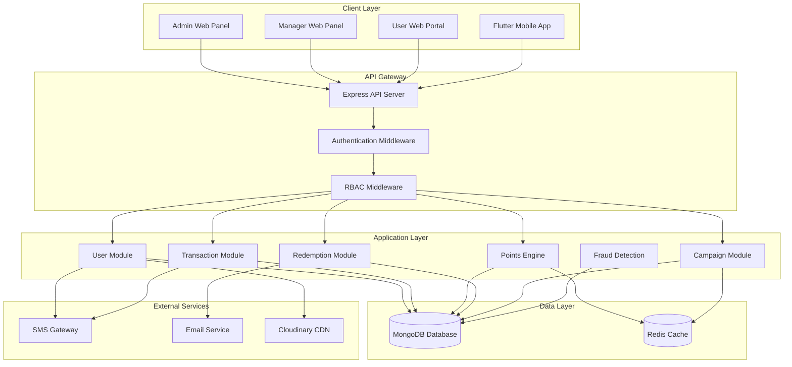
```mermaid
graph TB
    subgraph "Client Layer"
        A[Admin Web Panel]
        M[Manager Web Panel]
        U[User Web Portal]
        F[Flutter Mobile App]
    end
    
    subgraph "API Gateway"
        AG[Express API Server]
        AUTH[Authentication Middleware]
        RBAC[RBAC Middleware]
    end
    
    subgraph "Application Layer"
        UM[User Module]
        TM[Transaction Module]
        PM[Points Engine]
        RM[Redemption Module]
        CM[Campaign Module]
        FD[Fraud Detection]
    end
    
    subgraph "Data Layer"
        DB[(MongoDB Database)]
        CACHE[(Redis Cache)]
    end
    
    subgraph "External Services"
        SMS[SMS Gateway]
        EMAIL[Email Service]
        CDN[Cloudinary CDN]
    end
    
    A --> AG
    M --> AG
    U --> AG
    F --> AG
    
    AG --> AUTH
    AUTH --> RBAC
    RBAC --> UM
    RBAC --> TM
    RBAC --> PM
    RBAC --> RM
    RBAC --> CM
    
    UM --> DB
    TM --> DB
    PM --> DB
    RM --> DB
    CM --> DB
    FD --> DB
    
    PM --> CACHE
    CM --> CACHE
    
    UM --> SMS
    TM --> SMS
    RM --> EMAIL
    UM --> CDN
```

### 6.5.2 User Registration Flow

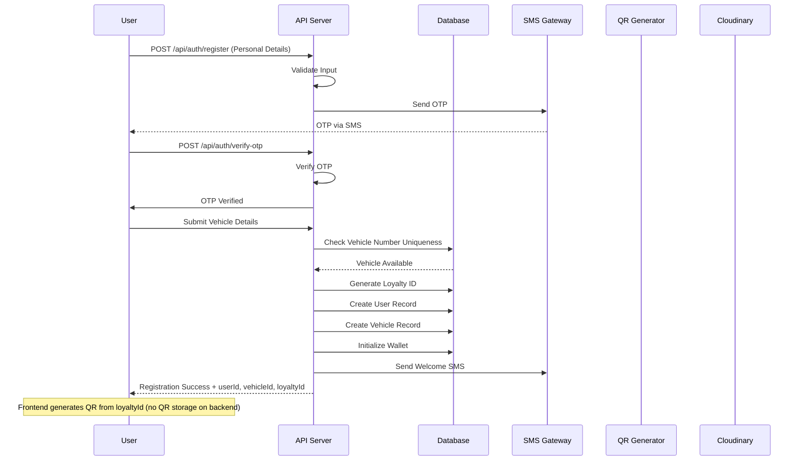
```mermaid
sequenceDiagram
    participant U as User
    participant API as API Server
    participant DB as Database
    participant SMS as SMS Gateway
    participant QR as QR Generator
    participant CDN as Cloudinary

    U->>API: POST /api/auth/register (Personal Details)
    API->>API: Validate Input
    API->>SMS: Send OTP
    SMS-->>U: OTP via SMS
    U->>API: POST /api/auth/verify-otp
    API->>API: Verify OTP
    API->>U: OTP Verified
    
    U->>API: Submit Vehicle Details
    API->>DB: Check Vehicle Number Uniqueness
    DB-->>API: Vehicle Available
    
    API->>DB: Generate Loyalty ID
    API->>DB: Create User Record
    API->>DB: Create Vehicle Record
    API->>DB: Initialize Wallet
    
    API->>SMS: Send Welcome SMS
    API-->>U: Registration Success + userId, vehicleId, loyaltyId
    
    Note over U: Frontend generates QR from loyaltyId (no QR storage on backend)
```

### 6.5.3 Transaction Processing Flow

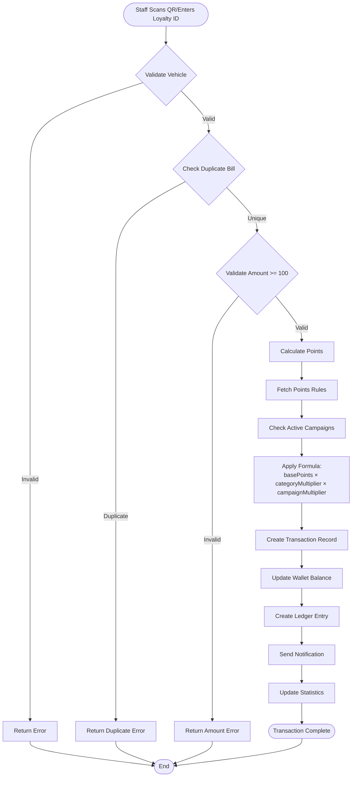
```mermaid
flowchart TD
    Start([Staff Scans QR/Enters Loyalty ID]) --> Validate{Validate Vehicle}
    Validate -->|Invalid| Error1[Return Error]
    Validate -->|Valid| CheckDup{Check Duplicate Bill}
    
    CheckDup -->|Duplicate| Error2[Return Duplicate Error]
    CheckDup -->|Unique| ValidateAmount{Validate Amount >= 100}
    
    ValidateAmount -->|Invalid| Error3[Return Amount Error]
    ValidateAmount -->|Valid| CalcPoints[Calculate Points]
    
    CalcPoints --> GetRules[Fetch Points Rules]
    GetRules --> GetCampaign[Check Active Campaigns]
    GetCampaign --> Calculate[Apply Formula:<br/>basePoints × categoryMultiplier × campaignMultiplier]
    
    Calculate --> CreateTxn[Create Transaction Record]
    CreateTxn --> UpdateWallet[Update Wallet Balance]
    UpdateWallet --> CreateLedger[Create Ledger Entry]
    
    CreateLedger --> SendNotif[Send Notification]
    SendNotif --> UpdateStats[Update Statistics]
    UpdateStats --> Success([Transaction Complete])
    
    Error1 --> End
    Error2 --> End
    Error3 --> End
    Success --> End([End])
```

### 6.5.4 Points Calculation Engine

```mermaid
graph LR
    A[Transaction Amount] --> B{Base Calculation}
    B --> C[basePoints = floor(amount / 100)]
    
    C --> D{Category Multiplier}
    D -->|Fuel| E[multiplier = 1.0]
    D -->|Lubricant| F[multiplier = 2.0]
    D -->|Store| G[multiplier = 3.0]
    
    E --> H[Apply Category]
    F --> H
    G --> H
    
    H --> I{Campaign Check}
    I -->|Active Campaign| J[Apply Campaign Multiplier]
    I -->|No Campaign| K[multiplier = 1.0]
    
    J --> L[finalPoints = basePoints × categoryMultiplier × campaignMultiplier]
    K --> L
    
    L --> M{Apply Limits}
    M -->|Within Limit| N[Credit Points]
    M -->|Exceeds Limit| O[Apply Maximum Cap]
    
    N --> P[Update Wallet]
    O --> P
    P --> Q[Create Ledger Entry]
```

### 6.5.5 Redemption Flow

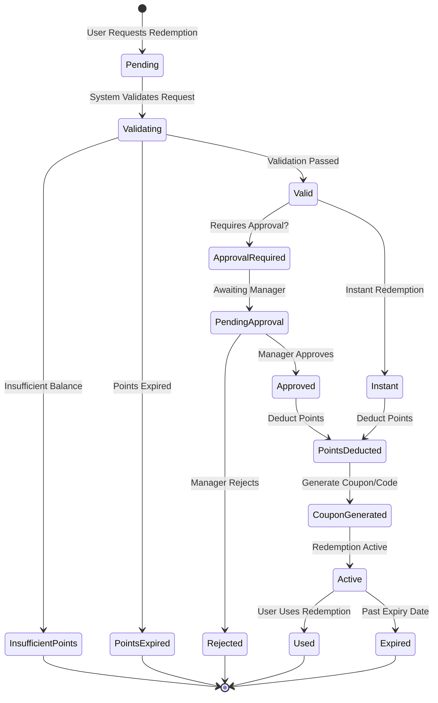
```mermaid
stateDiagram-v2
    [*] --> Pending: User Requests Redemption
    Pending --> Validating: System Validates Request
    
    Validating --> InsufficientPoints: Insufficient Balance
    Validating --> PointsExpired: Points Expired
    Validating --> Valid: Validation Passed
    
    InsufficientPoints --> [*]
    PointsExpired --> [*]
    
    Valid --> ApprovalRequired: Requires Approval?
    Valid --> Instant: Instant Redemption
    
    ApprovalRequired --> PendingApproval: Awaiting Manager
    PendingApproval --> Approved: Manager Approves
    PendingApproval --> Rejected: Manager Rejects
    
    Approved --> PointsDeducted: Deduct Points
    Instant --> PointsDeducted: Deduct Points
    
    PointsDeducted --> CouponGenerated: Generate Coupon/Code
    CouponGenerated --> Active: Redemption Active
    
    Active --> Used: User Uses Redemption
    Active --> Expired: Past Expiry Date
    
    Rejected --> [*]
    Used --> [*]
    Expired --> [*]
```

### 6.5.6 Database Entity Relationship Diagram

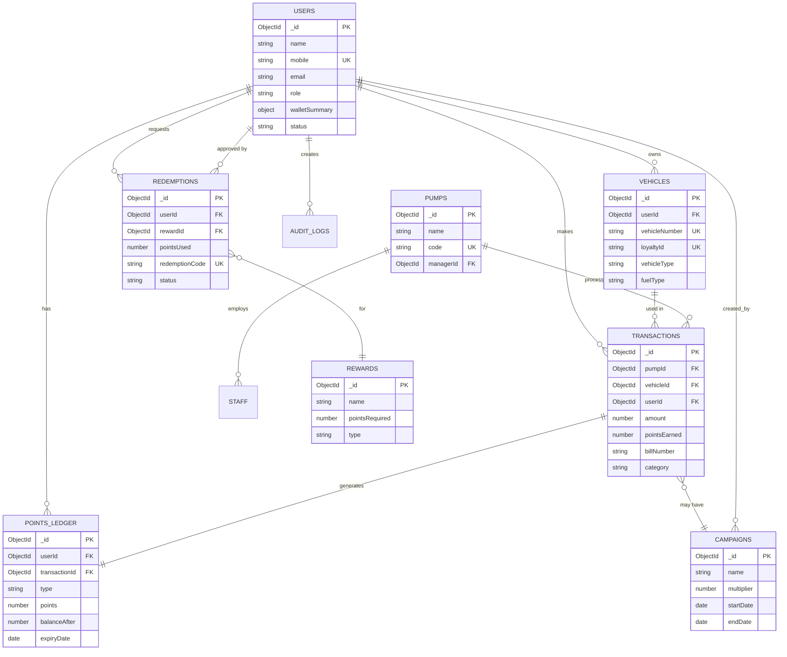
```mermaid
erDiagram
    USERS ||--o{ VEHICLES : owns
    USERS ||--o{ TRANSACTIONS : makes
    USERS ||--o{ POINTS_LEDGER : has
    USERS ||--o{ REDEMPTIONS : requests
    USERS ||--o{ AUDIT_LOGS : creates
    
    VEHICLES ||--o{ TRANSACTIONS : "used in"
    
    PUMPS ||--o{ TRANSACTIONS : processes
    PUMPS ||--o{ STAFF : employs
    
    TRANSACTIONS ||--|| POINTS_LEDGER : generates
    TRANSACTIONS }o--|| CAMPAIGNS : "may have"
    
    REDEMPTIONS }o--|| REWARDS : "for"
    REDEMPTIONS }o--|| USERS : "approved by"
    
    CAMPAIGNS }o--|| USERS : created_by
    
    USERS {
        ObjectId _id PK
        string name
        string mobile UK
        string email
        string role
        object walletSummary
        string status
    }
    
    VEHICLES {
        ObjectId _id PK
        ObjectId userId FK
        string vehicleNumber UK
        string loyaltyId UK
        string vehicleType
        string fuelType
    }
    
    TRANSACTIONS {
        ObjectId _id PK
        ObjectId pumpId FK
        ObjectId vehicleId FK
        ObjectId userId FK
        number amount
        number pointsEarned
        string billNumber
        string category
    }
    
    POINTS_LEDGER {
        ObjectId _id PK
        ObjectId userId FK
        ObjectId transactionId FK
        string type
        number points
        number balanceAfter
        date expiryDate
    }
    
    REDEMPTIONS {
        ObjectId _id PK
        ObjectId userId FK
        ObjectId rewardId FK
        number pointsUsed
        string redemptionCode UK
        string status
    }
    
    PUMPS {
        ObjectId _id PK
        string name
        string code UK
        ObjectId managerId FK
    }
    
    CAMPAIGNS {
        ObjectId _id PK
        string name
        number multiplier
        date startDate
        date endDate
    }
    
    REWARDS {
        ObjectId _id PK
        string name
        number pointsRequired
        string type
    }
```

### 6.5.7 API Request Flow

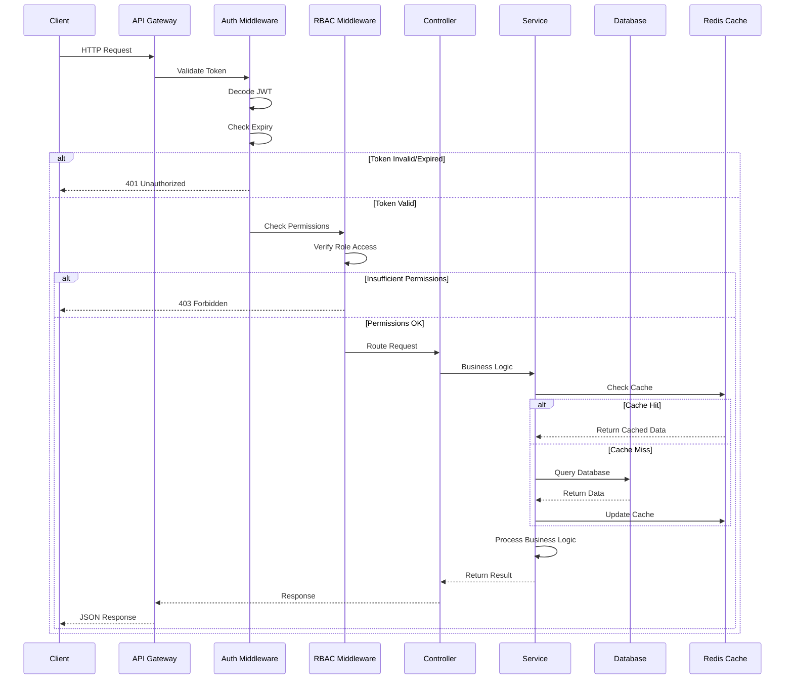
```mermaid
sequenceDiagram
    participant Client
    participant Gateway as API Gateway
    participant Auth as Auth Middleware
    participant RBAC as RBAC Middleware
    participant Controller
    participant Service
    participant DB as Database
    participant Cache as Redis Cache

    Client->>Gateway: HTTP Request
    Gateway->>Auth: Validate Token
    Auth->>Auth: Decode JWT
    Auth->>Auth: Check Expiry
    
    alt Token Invalid/Expired
        Auth-->>Client: 401 Unauthorized
    else Token Valid
        Auth->>RBAC: Check Permissions
        RBAC->>RBAC: Verify Role Access
        
        alt Insufficient Permissions
            RBAC-->>Client: 403 Forbidden
        else Permissions OK
            RBAC->>Controller: Route Request
            Controller->>Service: Business Logic
            
            Service->>Cache: Check Cache
            alt Cache Hit
                Cache-->>Service: Return Cached Data
            else Cache Miss
                Service->>DB: Query Database
                DB-->>Service: Return Data
                Service->>Cache: Update Cache
            end
            
            Service->>Service: Process Business Logic
            Service-->>Controller: Return Result
            Controller-->>Gateway: Response
            Gateway-->>Client: JSON Response
        end
    end
```

### 6.5.8 Wallet & Points Management Flow

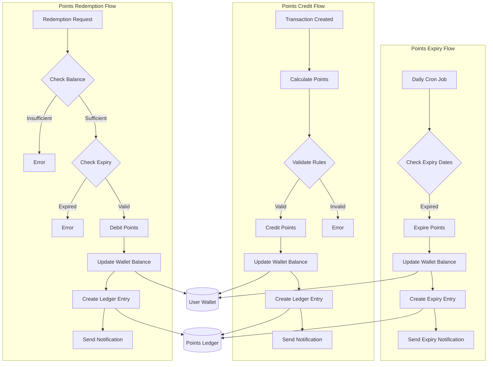
```mermaid
graph TB
    subgraph "Points Credit Flow"
        Txn[Transaction Created] --> Calc[Calculate Points]
        Calc --> Validate1{Validate Rules}
        Validate1 -->|Valid| Credit[Credit Points]
        Validate1 -->|Invalid| Error1[Error]
        Credit --> UpdateWallet[Update Wallet Balance]
        UpdateWallet --> CreateLedger[Create Ledger Entry]
        CreateLedger --> Notify1[Send Notification]
    end
    
    subgraph "Points Redemption Flow"
        Redeem[Redemption Request] --> CheckBalance{Check Balance}
        CheckBalance -->|Insufficient| Error2[Error]
        CheckBalance -->|Sufficient| CheckExpiry{Check Expiry}
        CheckExpiry -->|Expired| Error3[Error]
        CheckExpiry -->|Valid| Debit[Debit Points]
        Debit --> UpdateWallet2[Update Wallet Balance]
        UpdateWallet2 --> CreateLedger2[Create Ledger Entry]
        CreateLedger2 --> Notify2[Send Notification]
    end
    
    subgraph "Points Expiry Flow"
        DailyJob[Daily Cron Job] --> CheckExpiryDate{Check Expiry Dates}
        CheckExpiryDate -->|Expired| Expire[Expire Points]
        Expire --> UpdateWallet3[Update Wallet Balance]
        UpdateWallet3 --> CreateLedger3[Create Expiry Entry]
        CreateLedger3 --> Notify3[Send Expiry Notification]
    end
    
    CreateLedger --> Ledger[(Points Ledger)]
    CreateLedger2 --> Ledger
    CreateLedger3 --> Ledger
    
    UpdateWallet --> Wallet[(User Wallet)]
    UpdateWallet2 --> Wallet
    UpdateWallet3 --> Wallet
```

### 6.5.9 Deployment Architecture

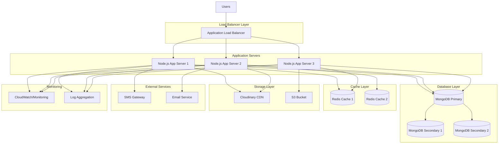
```mermaid
graph TB
    subgraph "Load Balancer Layer"
        LB[Application Load Balancer]
    end
    
    subgraph "Application Servers"
        APP1[Node.js App Server 1]
        APP2[Node.js App Server 2]
        APP3[Node.js App Server 3]
    end
    
    subgraph "Database Layer"
        PRIMARY[(MongoDB Primary)]
        SECONDARY1[(MongoDB Secondary 1)]
        SECONDARY2[(MongoDB Secondary 2)]
    end
    
    subgraph "Cache Layer"
        REDIS1[(Redis Cache 1)]
        REDIS2[(Redis Cache 2)]
    end
    
    subgraph "Storage Layer"
        CDN[Cloudinary CDN]
        S3[S3 Bucket]
    end
    
    subgraph "External Services"
        SMS[SMS Gateway]
        EMAIL[Email Service]
    end
    
    subgraph "Monitoring"
        MONITOR[CloudWatch/Monitoring]
        LOGS[Log Aggregation]
    end
    
    Users --> LB
    LB --> APP1
    LB --> APP2
    LB --> APP3
    
    APP1 --> PRIMARY
    APP2 --> PRIMARY
    APP3 --> PRIMARY
    
    PRIMARY --> SECONDARY1
    PRIMARY --> SECONDARY2
    
    APP1 --> REDIS1
    APP2 --> REDIS2
    APP3 --> REDIS1
    
    APP1 --> CDN
    APP2 --> CDN
    APP3 --> S3
    
    APP1 --> SMS
    APP2 --> EMAIL
    
    APP1 --> MONITOR
    APP2 --> MONITOR
    APP3 --> MONITOR
    
    APP1 --> LOGS
    APP2 --> LOGS
    APP3 --> LOGS
```

### 6.5.10 User Journey Flow

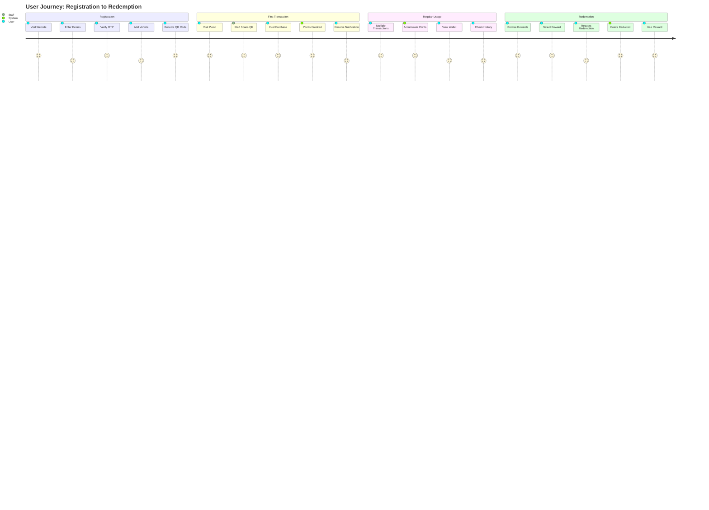
```mermaid
journey
    title User Journey: Registration to Redemption
    section Registration
      Visit Website: 5: User
      Enter Details: 4: User
      Verify OTP: 5: User
      Add Vehicle: 4: User
      Receive QR Code: 5: User
    section First Transaction
      Visit Pump: 5: User
      Staff Scans QR: 5: Staff
      Fuel Purchase: 5: User
      Points Credited: 5: System
      Receive Notification: 4: User
    section Regular Usage
      Multiple Transactions: 5: User
      Accumulate Points: 5: System
      View Wallet: 4: User
      Check History: 4: User
    section Redemption
      Browse Rewards: 5: User
      Select Reward: 5: User
      Request Redemption: 4: User
      Points Deducted: 5: System
      Use Reward: 5: User
```

### 6.5.11 Fraud Detection Flow

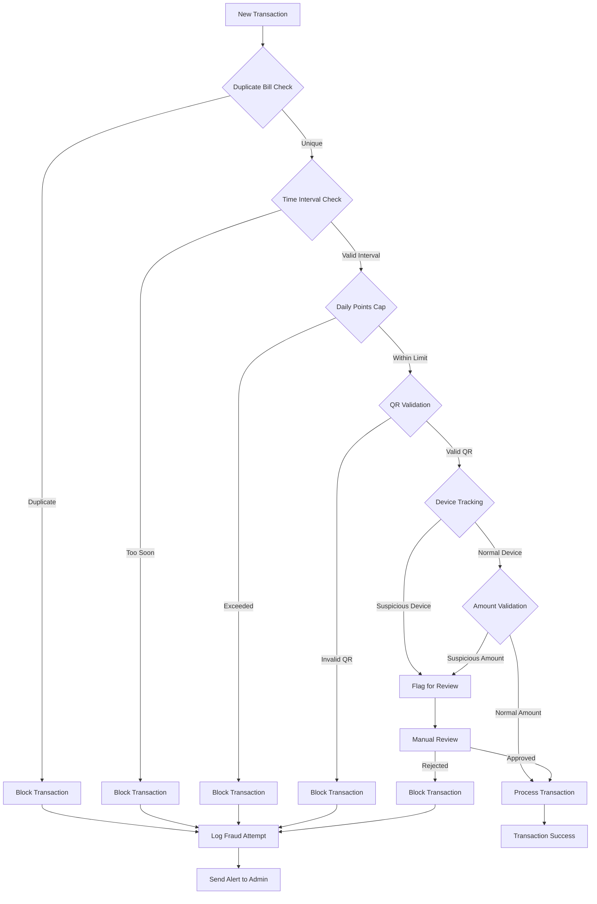
```mermaid
flowchart TD
    Txn[New Transaction] --> Check1{Duplicate Bill Check}
    Check1 -->|Duplicate| Block1[Block Transaction]
    Check1 -->|Unique| Check2{Time Interval Check}
    
    Check2 -->|Too Soon| Block2[Block Transaction]
    Check2 -->|Valid Interval| Check3{Daily Points Cap}
    
    Check3 -->|Exceeded| Block3[Block Transaction]
    Check3 -->|Within Limit| Check4{QR Validation}
    
    Check4 -->|Invalid QR| Block4[Block Transaction]
    Check4 -->|Valid QR| Check5{Device Tracking}
    
    Check5 -->|Suspicious Device| Flag[Flag for Review]
    Check5 -->|Normal Device| Check6{Amount Validation}
    
    Check6 -->|Suspicious Amount| Flag
    Check6 -->|Normal Amount| Process[Process Transaction]
    
    Flag --> Review[Manual Review]
    Review -->|Approved| Process
    Review -->|Rejected| Block5[Block Transaction]
    
    Block1 --> Log[Log Fraud Attempt]
    Block2 --> Log
    Block3 --> Log
    Block4 --> Log
    Block5 --> Log
    
    Process --> Success[Transaction Success]
    Log --> Alert[Send Alert to Admin]
```

### 6.5.12 Campaign Application Flow

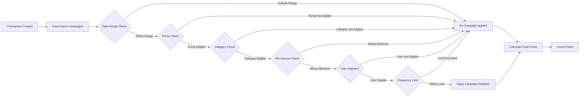
```mermaid
graph LR
    Txn[Transaction Created] --> GetCampaigns[Fetch Active Campaigns]
    GetCampaigns --> Filter1{Date Range Check}
    
    Filter1 -->|Outside Range| NoCampaign[No Campaign Applied]
    Filter1 -->|Within Range| Filter2{Pump Check}
    
    Filter2 -->|Pump Not Eligible| NoCampaign
    Filter2 -->|Pump Eligible| Filter3{Category Check}
    
    Filter3 -->|Category Not Eligible| NoCampaign
    Filter3 -->|Category Eligible| Filter4{Min Amount Check}
    
    Filter4 -->|Below Minimum| NoCampaign
    Filter4 -->|Above Minimum| Filter5{User Segment}
    
    Filter5 -->|User Not Eligible| NoCampaign
    Filter5 -->|User Eligible| Filter6{Frequency Limit}
    
    Filter6 -->|Limit Exceeded| NoCampaign
    Filter6 -->|Within Limit| ApplyCampaign[Apply Campaign Multiplier]
    
    ApplyCampaign --> CalcPoints[Calculate Final Points]
    NoCampaign --> CalcPoints
    CalcPoints --> Credit[Credit Points]
```

### 6.5.13 System Components Interaction

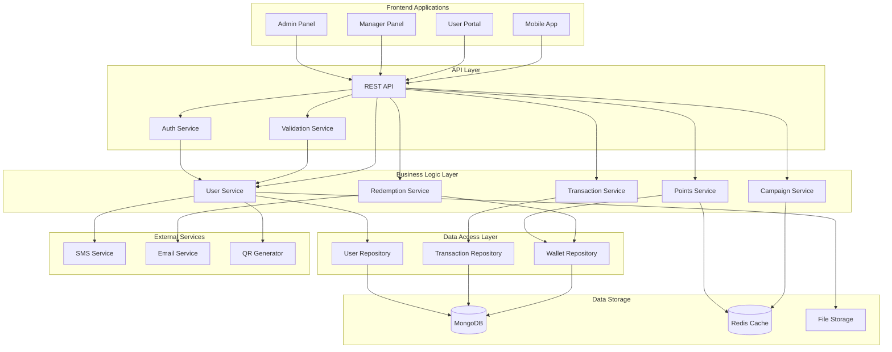
```mermaid
graph TB
    subgraph "Frontend Applications"
        Admin[Admin Panel]
        Manager[Manager Panel]
        User[User Portal]
        Mobile[Mobile App]
    end
    
    subgraph "API Layer"
        REST[REST API]
        Auth[Auth Service]
        Validator[Validation Service]
    end
    
    subgraph "Business Logic Layer"
        UserService[User Service]
        TxnService[Transaction Service]
        PointsService[Points Service]
        RedeemService[Redemption Service]
        CampaignService[Campaign Service]
    end
    
    subgraph "Data Access Layer"
        UserRepo[User Repository]
        TxnRepo[Transaction Repository]
        WalletRepo[Wallet Repository]
    end
    
    subgraph "Data Storage"
        MongoDB[(MongoDB)]
        Redis[(Redis Cache)]
        Files[File Storage]
    end
    
    subgraph "External Services"
        SMS[SMS Service]
        Email[Email Service]
        QR[QR Generator]
    end
    
    Admin --> REST
    Manager --> REST
    User --> REST
    Mobile --> REST
    
    REST --> Auth
    REST --> Validator
    Auth --> UserService
    Validator --> UserService
    
    REST --> UserService
    REST --> TxnService
    REST --> PointsService
    REST --> RedeemService
    REST --> CampaignService
    
    UserService --> UserRepo
    TxnService --> TxnRepo
    PointsService --> WalletRepo
    RedeemService --> WalletRepo
    
    UserRepo --> MongoDB
    TxnRepo --> MongoDB
    WalletRepo --> MongoDB
    
    PointsService --> Redis
    CampaignService --> Redis
    
    UserService --> SMS
    RedeemService --> Email
    UserService --> QR
    UserService --> Files
```

### 6.5.14 Data Flow Diagram

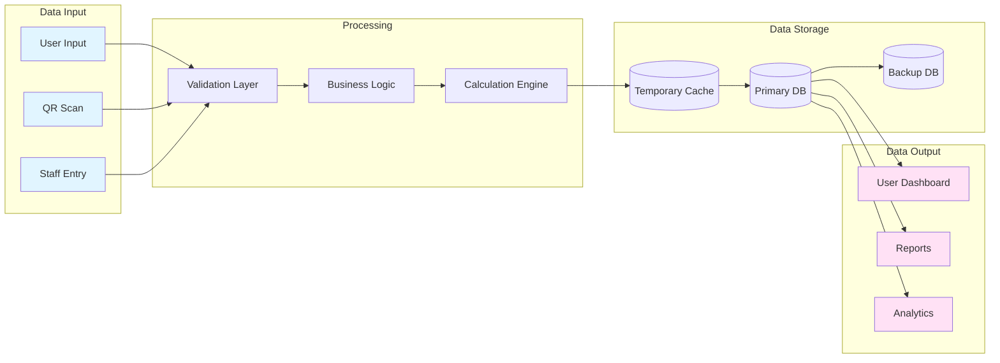
```mermaid
flowchart LR
    subgraph "Data Input"
        UserInput[User Input]
        QRScan[QR Scan]
        StaffInput[Staff Entry]
    end
    
    subgraph "Processing"
        Validate[Validation Layer]
        BusinessLogic[Business Logic]
        Calculate[Calculation Engine]
    end
    
    subgraph "Data Storage"
        Temp[(Temporary Cache)]
        Primary[(Primary DB)]
        Backup[(Backup DB)]
    end
    
    subgraph "Data Output"
        UserView[User Dashboard]
        Reports[Reports]
        Analytics[Analytics]
    end
    
    UserInput --> Validate
    QRScan --> Validate
    StaffInput --> Validate
    
    Validate --> BusinessLogic
    BusinessLogic --> Calculate
    
    Calculate --> Temp
    Temp --> Primary
    Primary --> Backup
    
    Primary --> UserView
    Primary --> Reports
    Primary --> Analytics
    
    style UserInput fill:#e1f5ff
    style QRScan fill:#e1f5ff
    style StaffInput fill:#e1f5ff
    style UserView fill:#ffe1f5
    style Reports fill:#ffe1f5
    style Analytics fill:#ffe1f5
```

### 6.5.15 Security Architecture

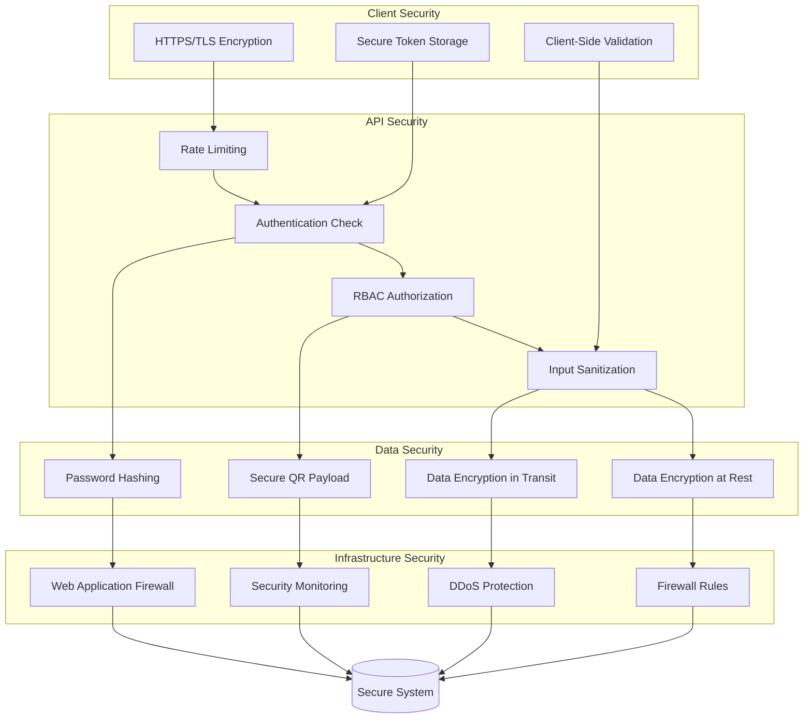
```mermaid
graph TB
    subgraph "Client Security"
        HTTPS[HTTPS/TLS Encryption]
        TokenStorage[Secure Token Storage]
        InputValidation[Client-Side Validation]
    end
    
    subgraph "API Security"
        RateLimit[Rate Limiting]
        AuthCheck[Authentication Check]
        RBACCheck[RBAC Authorization]
        InputSanitize[Input Sanitization]
    end
    
    subgraph "Data Security"
        Encryption[Data Encryption at Rest]
        TransitEncrypt[Data Encryption in Transit]
        HashPasswords[Password Hashing]
        SecureQR[Secure QR Payload]
    end
    
    subgraph "Infrastructure Security"
        Firewall[Firewall Rules]
        DDoS[DDoS Protection]
        WAF[Web Application Firewall]
        Monitoring[Security Monitoring]
    end
    
    HTTPS --> RateLimit
    TokenStorage --> AuthCheck
    InputValidation --> InputSanitize
    
    RateLimit --> AuthCheck
    AuthCheck --> RBACCheck
    RBACCheck --> InputSanitize
    
    InputSanitize --> Encryption
    InputSanitize --> TransitEncrypt
    AuthCheck --> HashPasswords
    RBACCheck --> SecureQR
    
    Encryption --> Firewall
    TransitEncrypt --> DDoS
    HashPasswords --> WAF
    SecureQR --> Monitoring
    
    Firewall --> Secure[(Secure System)]
    DDoS --> Secure
    WAF --> Secure
    Monitoring --> Secure
```

### 6.5.16 QR Code Scanning Flow

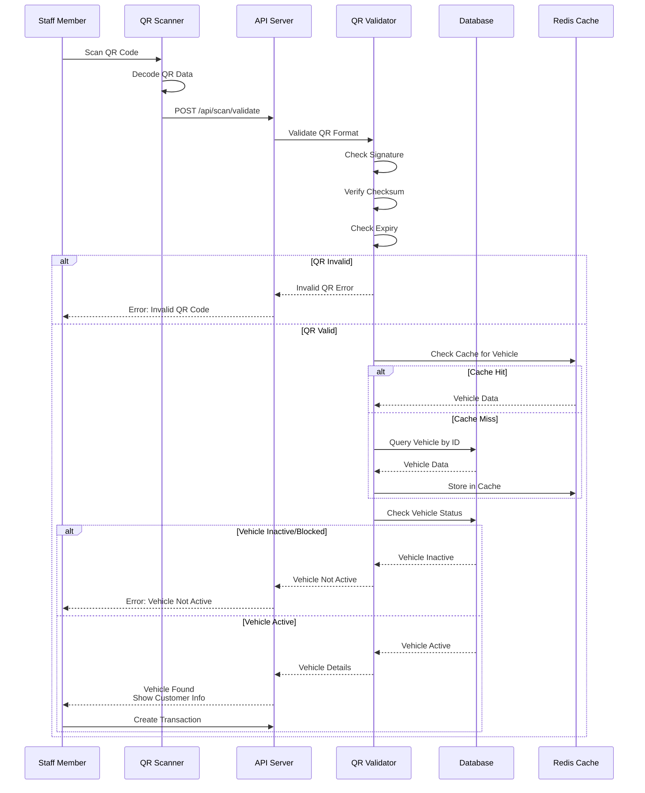
```mermaid
sequenceDiagram
    participant Staff as Staff Member
    participant Scanner as QR Scanner
    participant API as API Server
    participant Validator as QR Validator
    participant DB as Database
    participant Cache as Redis Cache

    Staff->>Scanner: Scan QR Code
    Scanner->>Scanner: Decode QR Data
    Scanner->>API: POST /api/scan/validate
    
    API->>Validator: Validate QR Format
    Validator->>Validator: Check Signature
    Validator->>Validator: Verify Checksum
    Validator->>Validator: Check Expiry
    
    alt QR Invalid
        Validator-->>API: Invalid QR Error
        API-->>Staff: Error: Invalid QR Code
    else QR Valid
        Validator->>Cache: Check Cache for Vehicle
        alt Cache Hit
            Cache-->>Validator: Vehicle Data
        else Cache Miss
            Validator->>DB: Query Vehicle by ID
            DB-->>Validator: Vehicle Data
            Validator->>Cache: Store in Cache
        end
        
        Validator->>DB: Check Vehicle Status
        alt Vehicle Inactive/Blocked
            DB-->>Validator: Vehicle Inactive
            Validator-->>API: Vehicle Not Active
            API-->>Staff: Error: Vehicle Not Active
        else Vehicle Active
            DB-->>Validator: Vehicle Active
            Validator-->>API: Vehicle Details
            API-->>Staff: Vehicle Found<br/>Show Customer Info
            Staff->>API: Create Transaction
        end
    end
```

### 6.5.17 Points Expiry Processing Flow

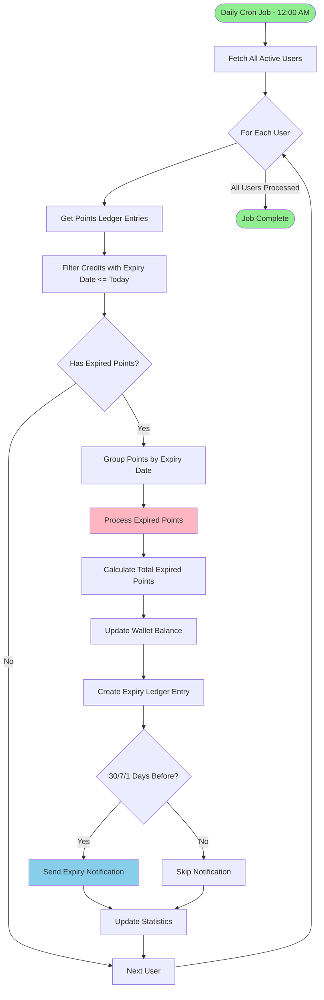
```mermaid
flowchart TD
    Start([Daily Cron Job - 12:00 AM]) --> FetchUsers[Fetch All Active Users]
    FetchUsers --> ForEachUser{For Each User}
    
    ForEachUser --> GetLedger[Get Points Ledger Entries]
    GetLedger --> FilterExpired[Filter Credits with Expiry Date <= Today]
    
    FilterExpired --> CheckBalance{Has Expired Points?}
    CheckBalance -->|No| NextUser[Next User]
    CheckBalance -->|Yes| GroupByExpiry[Group Points by Expiry Date]
    
    GroupByExpiry --> ProcessExpiry[Process Expired Points]
    ProcessExpiry --> CalculateExpired[Calculate Total Expired Points]
    
    CalculateExpired --> UpdateWallet[Update Wallet Balance]
    UpdateWallet --> CreateExpiryEntry[Create Expiry Ledger Entry]
    
    CreateExpiryEntry --> CheckNotification{30/7/1 Days Before?}
    CheckNotification -->|Yes| SendNotification[Send Expiry Notification]
    CheckNotification -->|No| SkipNotification[Skip Notification]
    
    SendNotification --> UpdateStats[Update Statistics]
    SkipNotification --> UpdateStats
    UpdateStats --> NextUser
    
    NextUser --> ForEachUser
    ForEachUser -->|All Users Processed| End([Job Complete])
    
    style Start fill:#90EE90
    style End fill:#90EE90
    style ProcessExpiry fill:#FFB6C1
    style SendNotification fill:#87CEEB
```

### 6.5.18 Multi-Pump Management Flow

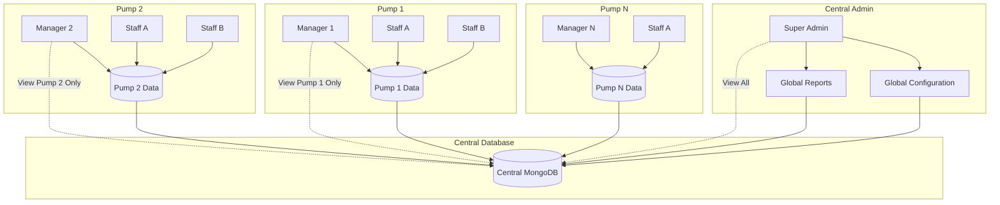
```mermaid
graph TB
    subgraph "Central Admin"
        Admin[Super Admin]
        GlobalConfig[Global Configuration]
        GlobalReports[Global Reports]
    end
    
    subgraph "Pump 1"
        Manager1[Manager 1]
        Staff1A[Staff A]
        Staff1B[Staff B]
        Pump1DB[(Pump 1 Data)]
    end
    
    subgraph "Pump 2"
        Manager2[Manager 2]
        Staff2A[Staff A]
        Staff2B[Staff B]
        Pump2DB[(Pump 2 Data)]
    end
    
    subgraph "Pump N"
        ManagerN[Manager N]
        StaffNA[Staff A]
        PumpNDB[(Pump N Data)]
    end
    
    subgraph "Central Database"
        CentralDB[(Central MongoDB)]
    end
    
    Admin --> GlobalConfig
    Admin --> GlobalReports
    GlobalConfig --> CentralDB
    GlobalReports --> CentralDB
    
    Manager1 --> Pump1DB
    Staff1A --> Pump1DB
    Staff1B --> Pump1DB
    Pump1DB --> CentralDB
    
    Manager2 --> Pump2DB
    Staff2A --> Pump2DB
    Staff2B --> Pump2DB
    Pump2DB --> CentralDB
    
    ManagerN --> PumpNDB
    StaffNA --> PumpNDB
    PumpNDB --> CentralDB
    
    Admin -.->|View All| CentralDB
    Manager1 -.->|View Pump 1 Only| CentralDB
    Manager2 -.->|View Pump 2 Only| CentralDB
```

---

# 7. Database Design (High-Level)

Collections:

## Users
- _id
- name
- mobile
- role
- walletSummary
- status

## Vehicles
- _id
- userId
- vehicleNumber (unique)
- loyaltyId (unique) — ID for frontend QR generation and backend verification; no QR storage
- status

## Pumps
- _id
- name
- location
- managerId

## Transactions
- _id
- pumpId
- vehicleId
- amount
- category
- billNumber
- pointsEarned
- createdBy
- timestamp

## PointsLedger
- _id
- userId
- transactionId
- type
- points
- balanceAfter

## Campaigns
- _id
- name
- multiplier
- startDate
- endDate
- conditions

## Redemptions
- _id
- userId
- pointsUsed
- rewardType
- status
- approvedBy

---

## 7.1 Logical Data Diagram (ERD)

### Complete Entity Relationship Diagram

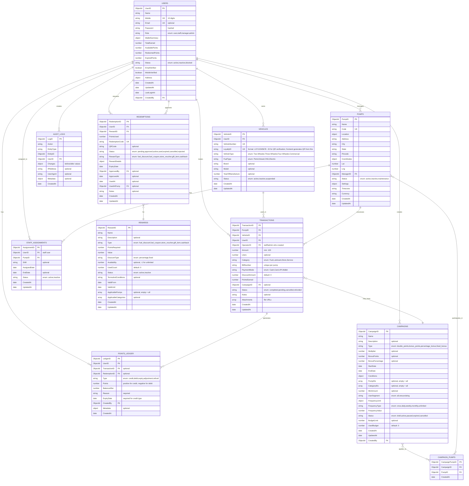
```mermaid
erDiagram
    USERS ||--o{ VEHICLES : "owns"
    USERS ||--o{ TRANSACTIONS : "makes"
    USERS ||--o{ POINTS_LEDGER : "has"
    USERS ||--o{ REDEMPTIONS : "requests"
    USERS ||--o{ AUDIT_LOGS : "creates"
    USERS ||--o{ STAFF_ASSIGNMENTS : "assigned_to"
    
    USERS ||--o{ PUMPS : "manages"
    USERS ||--o{ CAMPAIGNS : "creates"
    USERS ||--o{ REDEMPTIONS : "approves"
    
    VEHICLES ||--o{ TRANSACTIONS : "used_in"
    
    PUMPS ||--o{ TRANSACTIONS : "processes"
    PUMPS ||--o{ STAFF_ASSIGNMENTS : "has"
    
    TRANSACTIONS ||--o{ POINTS_LEDGER : "generates"
    TRANSACTIONS }o--|| CAMPAIGNS : "may_have"
    
    REDEMPTIONS }o--|| REWARDS : "for"
    
    CAMPAIGNS }o--o{ CAMPAIGN_PUMPS : "applies_to"
    PUMPS }o--o{ CAMPAIGN_PUMPS : "participates_in"
    
    USERS {
        ObjectId UserID PK
        string Name
        string Mobile UK "10 digits"
        string Email UK "optional"
        string Password "hashed"
        string Role "enum: user,staff,manager,admin"
        object WalletSummary
        number TotalEarned
        number AvailablePoints
        number RedeemedPoints
        number ExpiredPoints
        string Status "enum: active,inactive,blocked"
        boolean EmailVerified
        boolean MobileVerified
        object Address
        date CreatedAt
        date UpdatedAt
        date LastLoginAt
        ObjectId CreatedBy FK
    }
    
    VEHICLES {
        ObjectId VehicleID PK
        ObjectId UserID FK
        string VehicleNumber UK
        string LoyaltyID UK "format: LOY12345678 - ID for QR verification; frontend generates QR from this"
        string VehicleType "enum: Two-Wheeler,Three-Wheeler,Four-Wheeler,Commercial"
        string FuelType "enum: Petrol,Diesel,CNG,Electric"
        string Brand "optional"
        string Model "optional"
        number YearOfManufacture "optional"
        string Status "enum: active,inactive,suspended"
        date CreatedAt
        date UpdatedAt
    }
    
    PUMPS {
        ObjectId PumpID PK
        string Name
        string Code UK
        object Location
        string Address
        string City
        string State
        string Pincode
        object Coordinates
        number Lat
        number Lng
        ObjectId ManagerID FK
        string Status "enum: active,inactive,maintenance"
        object Settings
        string Timezone
        string Currency
        date CreatedAt
        date UpdatedAt
    }
    
    TRANSACTIONS {
        ObjectId TransactionID PK
        ObjectId PumpID FK
        ObjectId VehicleID FK
        ObjectId UserID FK
        ObjectId OperatorID FK "staff/admin who created"
        number Amount "min: 100"
        number Liters "optional"
        string Category "enum: Fuel,Lubricant,Store,Service"
        string BillNumber "unique per pump"
        string PaymentMode "enum: Cash,Card,UPI,Wallet"
        number DiscountAmount "default: 0"
        number PointsEarned
        ObjectId CampaignID FK "optional"
        string Status "enum: completed,pending,cancelled,refunded"
        string Notes "optional"
        array Attachments "file URLs"
        date CreatedAt
        date UpdatedAt
    }
    
    POINTS_LEDGER {
        ObjectId LedgerID PK
        ObjectId UserID FK
        ObjectId TransactionID FK "optional"
        ObjectId RedemptionID FK "optional"
        string Type "enum: credit,debit,expiry,adjustment,refund"
        number Points "positive for credit, negative for debit"
        number BalanceAfter
        string Reason "required"
        date ExpiryDate "required for credit type"
        ObjectId CreatedBy FK
        object Metadata "optional"
        date CreatedAt
    }
    
    CAMPAIGNS {
        ObjectId CampaignID PK
        string Name
        string Description "optional"
        string Type "enum: double_points,bonus_points,percentage_bonus,fixed_bonus"
        number Multiplier "optional"
        number BonusPoints "optional"
        number BonusPercentage "optional"
        date StartDate
        date EndDate
        object Conditions
        array PumpIDs "optional, empty = all"
        array CategoryIDs "optional, empty = all"
        number MinAmount "optional"
        string UserSegment "enum: all,new,existing"
        object FrequencyLimit
        string FrequencyType "enum: once,daily,weekly,monthly,unlimited"
        number FrequencyValue
        string Status "enum: draft,active,paused,expired,cancelled"
        number BudgetLimit "optional"
        number UsedBudget "default: 0"
        date CreatedAt
        date UpdatedAt
        ObjectId CreatedBy FK
    }
    
    REDEMPTIONS {
        ObjectId RedemptionID PK
        ObjectId UserID FK
        ObjectId RewardID FK
        number PointsUsed
        string RedemptionCode UK
        string QRCode "optional"
        string Status "enum: pending,approved,active,used,expired,cancelled,rejected"
        string RewardType "enum: fuel_discount,fuel_coupon,store_voucher,gift_item,cashback"
        object RewardDetails
        date ExpiryDate
        ObjectId ApprovedBy FK "optional"
        date ApprovedAt "optional"
        date UsedAt "optional"
        ObjectId UsedAtPump FK "optional"
        string Notes "optional"
        date CreatedAt
        date UpdatedAt
    }
    
    REWARDS {
        ObjectId RewardID PK
        string Name
        string Description "optional"
        string Type "enum: fuel_discount,fuel_coupon,store_voucher,gift_item,cashback"
        number PointsRequired
        number Value
        string DiscountType "enum: percentage,fixed"
        number Availability "optional, -1 for unlimited"
        number UsedCount "default: 0"
        string Status "enum: active,inactive"
        string TermsAndConditions "optional"
        date ValidFrom
        date ValidUntil
        array ApplicablePumps "optional, empty = all"
        array ApplicableCategories "optional"
        date CreatedAt
        date UpdatedAt
    }
    
    STAFF_ASSIGNMENTS {
        ObjectId AssignmentID PK
        ObjectId UserID FK "staff user"
        ObjectId PumpID FK
        string Shift "optional"
        date AssignedDate
        date EndDate "optional"
        string Status "enum: active,inactive"
        date CreatedAt
        date UpdatedAt
    }
    
    CAMPAIGN_PUMPS {
        ObjectId CampaignPumpID PK
        ObjectId CampaignID FK
        ObjectId PumpID FK
        date CreatedAt
    }
    
    AUDIT_LOGS {
        ObjectId LogID PK
        string Action
        string EntityType
        ObjectId EntityID
        ObjectId UserID FK
        object Changes "before/after values"
        string IPAddress "optional"
        string UserAgent "optional"
        object Metadata "optional"
        date CreatedAt
    }
```

### Relationship Details

**One-to-Many Relationships:**
- **USERS → VEHICLES:** One user can own multiple vehicles
- **USERS → TRANSACTIONS:** One user can make multiple transactions
- **USERS → POINTS_LEDGER:** One user has multiple ledger entries
- **USERS → REDEMPTIONS:** One user can request multiple redemptions
- **USERS → PUMPS:** One user (manager) can manage multiple pumps
- **USERS → CAMPAIGNS:** One user (admin) can create multiple campaigns
- **VEHICLES → TRANSACTIONS:** One vehicle can be used in multiple transactions
- **PUMPS → TRANSACTIONS:** One pump processes multiple transactions
- **TRANSACTIONS → POINTS_LEDGER:** One transaction generates one ledger entry
- **REWARDS → REDEMPTIONS:** One reward can be redeemed multiple times
- **CAMPAIGNS → TRANSACTIONS:** One campaign can apply to multiple transactions

**Many-to-Many Relationships:**
- **CAMPAIGNS ↔ PUMPS:** Via `CAMPAIGN_PUMPS` junction table - campaigns can apply to multiple pumps, pumps can participate in multiple campaigns
- **USERS ↔ PUMPS:** Via `STAFF_ASSIGNMENTS` - staff users can be assigned to multiple pumps, pumps can have multiple staff

**Foreign Key Constraints:**
- All FK relationships enforce referential integrity
- Cascade delete rules apply where appropriate
- Unique constraints on combination fields (e.g., PumpID + BillNumber)

---

## 7.2 Data Flow Diagram

### Complete Data Flow Architecture

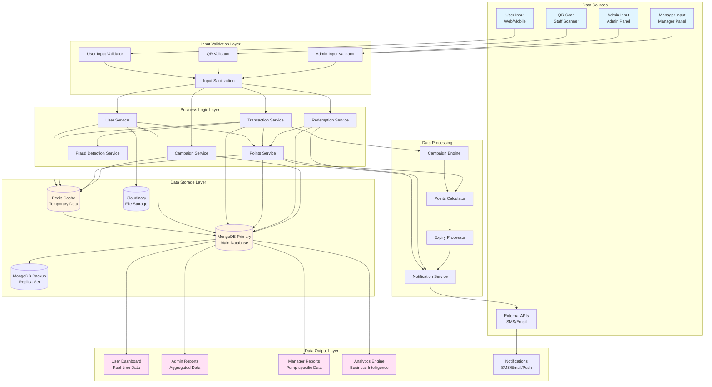
```mermaid
flowchart TB
    subgraph "Data Sources"
        UserInput[User Input<br/>Web/Mobile]
        QRInput[QR Scan<br/>Staff Scanner]
        AdminInput[Admin Input<br/>Admin Panel]
        ManagerInput[Manager Input<br/>Manager Panel]
        ExternalAPI[External APIs<br/>SMS/Email]
    end
    
    subgraph "Input Validation Layer"
        ValidateUser[User Input Validator]
        ValidateQR[QR Validator]
        ValidateAdmin[Admin Input Validator]
        Sanitize[Input Sanitization]
    end
    
    subgraph "Business Logic Layer"
        UserService[User Service]
        TransactionService[Transaction Service]
        PointsService[Points Service]
        RedemptionService[Redemption Service]
        CampaignService[Campaign Service]
        FraudService[Fraud Detection Service]
    end
    
    subgraph "Data Processing"
        PointsCalc[Points Calculator]
        CampaignEngine[Campaign Engine]
        ExpiryProcessor[Expiry Processor]
        NotificationService[Notification Service]
    end
    
    subgraph "Data Storage Layer"
        TempCache[(Redis Cache<br/>Temporary Data)]
        PrimaryDB[(MongoDB Primary<br/>Main Database)]
        BackupDB[(MongoDB Backup<br/>Replica Set)]
        FileStorage[(Cloudinary<br/>File Storage)]
    end
    
    subgraph "Data Output Layer"
        UserDashboard[User Dashboard<br/>Real-time Data]
        AdminReports[Admin Reports<br/>Aggregated Data]
        ManagerReports[Manager Reports<br/>Pump-specific Data]
        Analytics[Analytics Engine<br/>Business Intelligence]
        Notifications[Notifications<br/>SMS/Email/Push]
    end
    
    %% Input Flow
    UserInput --> ValidateUser
    QRInput --> ValidateQR
    AdminInput --> ValidateAdmin
    ManagerInput --> ValidateAdmin
    
    ValidateUser --> Sanitize
    ValidateQR --> Sanitize
    ValidateAdmin --> Sanitize
    
    %% Service Routing
    Sanitize --> UserService
    Sanitize --> TransactionService
    Sanitize --> RedemptionService
    Sanitize --> CampaignService
    
    %% Business Logic Processing
    UserService --> PointsService
    TransactionService --> PointsService
    TransactionService --> FraudService
    TransactionService --> CampaignEngine
    CampaignEngine --> PointsCalc
    PointsService --> PointsCalc
    
    PointsCalc --> ExpiryProcessor
    RedemptionService --> PointsService
    
    %% Data Storage Flow
    UserService --> TempCache
    TransactionService --> TempCache
    PointsService --> TempCache
    CampaignService --> TempCache
    
    TempCache --> PrimaryDB
    UserService --> PrimaryDB
    TransactionService --> PrimaryDB
    PointsService --> PrimaryDB
    RedemptionService --> PrimaryDB
    CampaignService --> PrimaryDB
    
    PrimaryDB --> BackupDB
    
    UserService --> FileStorage
    
    %% Output Flow
    PrimaryDB --> UserDashboard
    PrimaryDB --> AdminReports
    PrimaryDB --> ManagerReports
    PrimaryDB --> Analytics
    
    PointsService --> NotificationService
    RedemptionService --> NotificationService
    ExpiryProcessor --> NotificationService
    
    NotificationService --> ExternalAPI
    ExternalAPI --> Notifications
    
    %% Styling
    style UserInput fill:#e1f5ff
    style QRInput fill:#e1f5ff
    style AdminInput fill:#e1f5ff
    style ManagerInput fill:#e1f5ff
    style UserDashboard fill:#ffe1f5
    style AdminReports fill:#ffe1f5
    style ManagerReports fill:#ffe1f5
    style Analytics fill:#ffe1f5
    style PrimaryDB fill:#fff4e1
    style TempCache fill:#fff4e1
```

### Data Flow Description

**1. Data Input Flow:**
- User inputs from web/mobile applications
- QR code scans from staff scanners
- Admin/Manager inputs from management panels
- External API data (SMS, Email responses)

**2. Validation & Sanitization:**
- All inputs validated for format, type, and business rules
- Input sanitization to prevent injection attacks
- QR/ID validation (ID from QR or manual entry; no QR expiry)

**3. Business Logic Processing:**
- Services process business logic
- Points calculation engine computes points
- Campaign engine applies promotional rules
- Fraud detection service validates transactions

**4. Data Storage:**
- Temporary data stored in Redis cache for fast access
- Primary data stored in MongoDB with indexes
- Automatic backup to replica set
- Files (QR codes, receipts) stored in Cloudinary

**5. Data Output:**
- Real-time data to user dashboards
- Aggregated reports for admin/manager
- Analytics data for business intelligence
- Notifications sent via external services

---

## 7.3 API Interaction Diagram

### How APIs Work with Database

```mermaid
sequenceDiagram
    participant Client as Client Application
    participant API as API Gateway
    participant Auth as Auth Middleware
    participant Controller as API Controller
    participant Service as Business Service
    participant Cache as Redis Cache
    participant DB as MongoDB
    participant ExtSvc as External Services

    Note over Client,ExtSvc: API Request Flow
    
    Client->>API: HTTP Request (POST/GET/PUT/DELETE)
    API->>Auth: Validate JWT Token
    
    alt Token Invalid
        Auth-->>Client: 401 Unauthorized
    else Token Valid
        Auth->>Auth: Extract User Info
        Auth->>Controller: Route to Controller
        
        Controller->>Service: Call Business Service
        
        Note over Service,DB: Data Access Pattern
        
        Service->>Cache: Check Cache First
        
        alt Cache Hit
            Cache-->>Service: Return Cached Data
            Service->>Service: Process Business Logic
        else Cache Miss
            Service->>DB: Query Database
            DB-->>Service: Return Data
            Service->>Cache: Update Cache (TTL)
            Service->>Service: Process Business Logic
        end
        
        alt Requires External Service
            Service->>ExtSvc: Call External API
            ExtSvc-->>Service: External Response
        end
        
        Service->>DB: Write/Update Data (if needed)
        DB-->>Service: Confirm Write
        
        Service->>Cache: Invalidate Related Cache
        
        Service-->>Controller: Return Result
        Controller-->>API: JSON Response
        API-->>Client: HTTP 200 OK + Data
    end
```

### API Endpoint to Database Mapping

```mermaid
graph LR
    subgraph "API Endpoints"
        A1[POST /api/auth/register]
        A2[POST /api/transactions]
        A3[GET /api/users/:id/wallet]
        A4[POST /api/redeem]
        A5[GET /api/admin/dashboard]
        A6[POST /api/scan/validate]
    end
    
    subgraph "Controllers"
        C1[AuthController]
        C2[TransactionController]
        C3[WalletController]
        C4[RedemptionController]
        C5[AdminController]
        C6[ScanController]
    end
    
    subgraph "Services"
        S1[UserService]
        S2[TransactionService]
        S3[PointsService]
        S4[RedemptionService]
        S5[AnalyticsService]
        S6[ValidationService]
    end
    
    subgraph "Database Collections"
        D1[(Users)]
        D2[(Vehicles)]
        D3[(Transactions)]
        D4[(PointsLedger)]
        D5[(Redemptions)]
        D6[(Campaigns)]
        D7[(Pumps)]
        D8[(Rewards)]
    end
    
    A1 --> C1
    A2 --> C2
    A3 --> C3
    A4 --> C4
    A5 --> C5
    A6 --> C6
    
    C1 --> S1
    C2 --> S2
    C3 --> S3
    C4 --> S4
    C5 --> S5
    C6 --> S6
    
    S1 --> D1
    S1 --> D2
    S2 --> D3
    S2 --> D7
    S3 --> D4
    S3 --> D1
    S4 --> D5
    S4 --> D8
    S5 --> D1
    S5 --> D3
    S5 --> D4
    S6 --> D2
```

### Detailed API to Database Operations

#### 1. User Registration API Flow

```mermaid
sequenceDiagram
    participant API as POST /api/auth/register
    participant UserSvc as UserService
    participant Validator as Validator
    participant SMS as SMS Service
    participant QRGen as QR Generator
    participant DB as MongoDB

    API->>Validator: Validate Input Data
    Validator-->>API: Validation Result
    
    alt Validation Failed
        API-->>Client: 400 Bad Request
    else Validation Passed
        API->>SMS: Send OTP
        SMS-->>Client: OTP via SMS
        
        Note over Client: User Enters OTP
        
        API->>UserSvc: Verify OTP & Create User
        UserSvc->>DB: INSERT INTO Users
        DB-->>UserSvc: UserID
        
        UserSvc->>DB: INSERT INTO Vehicles (with loyaltyId)
        DB-->>UserSvc: VehicleID
        
        UserSvc->>DB: UPDATE Users SET WalletSummary
        DB-->>UserSvc: Success
        
        UserSvc-->>API: User + Vehicle + loyaltyId (no QR image; frontend generates QR from this ID)
        API-->>Client: 201 Created + Response
    end
```

#### 2. Transaction Creation API Flow

```mermaid
sequenceDiagram
    participant API as POST /api/transactions
    participant TxnSvc as TransactionService
    participant FraudSvc as FraudService
    participant PointsSvc as PointsService
    participant CampaignSvc as CampaignService
    participant DB as MongoDB
    participant Cache as Redis

    API->>TxnSvc: Create Transaction
    TxnSvc->>DB: SELECT Vehicle WHERE VehicleID
    DB-->>TxnSvc: Vehicle Data
    
    TxnSvc->>FraudSvc: Check Duplicate Bill
    FraudSvc->>DB: SELECT Transaction WHERE PumpID + BillNumber
    DB-->>FraudSvc: Check Result
    
    alt Duplicate Found
        FraudSvc-->>TxnSvc: Duplicate Error
        TxnSvc-->>API: 400 Duplicate Transaction
    else No Duplicate
        TxnSvc->>CampaignSvc: Get Active Campaigns
        CampaignSvc->>Cache: Check Campaign Cache
        Cache-->>CampaignSvc: Campaign Data
        
        TxnSvc->>PointsSvc: Calculate Points
        PointsSvc->>DB: SELECT PointsRules
        PointsSvc->>PointsSvc: Calculate: basePoints × multipliers
        PointsSvc-->>TxnSvc: Points Amount
        
        TxnSvc->>DB: INSERT INTO Transactions
        DB-->>TxnSvc: TransactionID
        
        TxnSvc->>DB: UPDATE Users SET WalletSummary
        DB-->>TxnSvc: Updated Balance
        
        TxnSvc->>DB: INSERT INTO PointsLedger
        DB-->>TxnSvc: LedgerID
        
        TxnSvc->>Cache: Invalidate User Cache
        TxnSvc-->>API: Transaction + Points Data
        API-->>Client: 201 Created + Response
    end
```

#### 3. Wallet Query API Flow

```mermaid
sequenceDiagram
    participant API as GET /api/users/:id/wallet
    participant WalletSvc as WalletService
    participant Cache as Redis
    participant DB as MongoDB

    API->>WalletSvc: Get Wallet Balance
    WalletSvc->>Cache: GET user:wallet:{userId}
    
    alt Cache Hit
        Cache-->>WalletSvc: Cached Wallet Data
        WalletSvc-->>API: Wallet Data
        API-->>Client: 200 OK + Cached Data
    else Cache Miss
        WalletSvc->>DB: SELECT Users WHERE UserID
        DB-->>WalletSvc: User Wallet Summary
        
        WalletSvc->>DB: SELECT PointsLedger WHERE UserID ORDER BY CreatedAt DESC LIMIT 10
        DB-->>WalletSvc: Recent Ledger Entries
        
        WalletSvc->>Cache: SET user:wallet:{userId} TTL 300s
        WalletSvc-->>API: Wallet + Ledger Data
        API-->>Client: 200 OK + Fresh Data
    end
```

#### 4. Redemption API Flow

```mermaid
sequenceDiagram
    participant API as POST /api/redeem
    participant RedeemSvc as RedemptionService
    participant PointsSvc as PointsService
    participant WalletSvc as WalletService
    participant DB as MongoDB
    participant EmailSvc as Email Service

    API->>RedeemSvc: Request Redemption
    RedeemSvc->>DB: SELECT Rewards WHERE RewardID
    DB-->>RedeemSvc: Reward Details
    
    RedeemSvc->>WalletSvc: Check Available Balance
    WalletSvc->>DB: SELECT Users WHERE UserID
    DB-->>WalletSvc: Wallet Balance
    
    alt Insufficient Points
        WalletSvc-->>RedeemSvc: Insufficient Balance
        RedeemSvc-->>API: 400 Insufficient Points
    else Sufficient Points
        RedeemSvc->>PointsSvc: Check Expiry Dates
        PointsSvc->>DB: SELECT PointsLedger WHERE UserID AND Type='credit' AND ExpiryDate > NOW
        DB-->>PointsSvc: Valid Points
        
        alt Points Expired
            PointsSvc-->>RedeemSvc: Points Expired
            RedeemSvc-->>API: 400 Points Expired
        else Points Valid
            RedeemSvc->>DB: INSERT INTO Redemptions
            DB-->>RedeemSvc: RedemptionID
            
            RedeemSvc->>PointsSvc: Debit Points
            PointsSvc->>DB: UPDATE Users SET WalletSummary
            PointsSvc->>DB: INSERT INTO PointsLedger
            DB-->>PointsSvc: Success
            
            RedeemSvc->>EmailSvc: Send Redemption Confirmation
            RedeemSvc-->>API: Redemption Data
            API-->>Client: 201 Created + Redemption Code
        end
    end
```

### API Response Time Optimization

```mermaid
graph TB
    Request[API Request] --> CacheCheck{Cache Check}
    
    CacheCheck -->|Hit| ReturnCache[Return Cached Data<br/>~10ms]
    CacheCheck -->|Miss| DBQuery[Database Query]
    
    DBQuery --> IndexCheck{Index Used?}
    IndexCheck -->|Yes| FastQuery[Fast Query<br/>~50ms]
    IndexCheck -->|No| SlowQuery[Slow Query<br/>~500ms]
    
    FastQuery --> ProcessData[Process Data]
    SlowQuery --> ProcessData
    
    ProcessData --> UpdateCache[Update Cache]
    UpdateCache --> ReturnData[Return Data<br/>~100ms]
    
    ReturnCache --> Response[Response to Client]
    ReturnData --> Response
    
    style ReturnCache fill:#90EE90
    style FastQuery fill:#87CEEB
    style SlowQuery fill:#FFB6C1
```

---

# 8. Fraud Prevention Rules

- Unique bill number per pump
- Minimum scan interval (e.g., 5 minutes)
- Daily points cap
- Manual credit approval workflow
- QR tamper validation
- Device-level tracking

---

# 9. Business Rules

- Points expire after configurable duration (default: 12 months)
- Points are non-transferable
- Negative wallet balance not allowed
- Redemption cannot exceed available balance
- Ledger entries are immutable

---

# 10. Milestones

Phase 1:
- Registration
- QR generation
- Transaction credit
- Wallet implementation

Phase 2:
- Redemption module
- Campaign engine
- Reports & dashboards

Phase 3:
- Tier-based loyalty
- Advanced fraud detection
- Analytics engine

---

# 11. API Specifications

## 11.1 API Overview

### Base URL
- **Production:** `https://api.fuelloyalty.com/v1`
- **Staging:** `https://staging-api.fuelloyalty.com/v1`
- **Development:** `http://localhost:3000/api/v1`

### Authentication
- **Method:** JWT Bearer Token
- **Header:** `Authorization: Bearer <token>`
- **Token Expiry:** 24 hours (refreshable)

### Response Format
```json
{
  "success": true,
  "message": "Operation successful",
  "data": {},
  "meta": {
    "timestamp": "2026-02-17T10:30:00Z",
    "requestId": "req_123456"
  }
}
```

### Error Format
```json
{
  "success": false,
  "message": "Error message",
  "errors": [
    {
      "field": "mobile",
      "message": "Mobile number is required"
    }
  ],
  "code": "VALIDATION_ERROR",
  "meta": {
    "timestamp": "2026-02-17T10:30:00Z",
    "requestId": "req_123456"
  }
}
```

## 11.2 Authentication APIs

### POST /api/auth/register
**Description:** User self-registration

**Request Body:**
```json
{
  "name": "John Doe",
  "mobile": "9876543210",
  "email": "john@example.com",
  "address": {
    "street": "123 Main St",
    "city": "Mumbai",
    "state": "Maharashtra",
    "pincode": "400001"
  },
  "vehicle": {
    "vehicleNumber": "MH12AB1234",
    "vehicleType": "Four-Wheeler",
    "fuelType": "Petrol",
    "brand": "Maruti",
    "model": "Swift"
  }
}
```

**Response:** 201 Created
```json
{
  "success": true,
  "data": {
    "userId": "user_123",
    "vehicleId": "vehicle_456",
    "loyaltyId": "LOY12345678",
    "qrCode": "https://cdn.example.com/qr/user_123.png",
    "wallet": {
      "availablePoints": 0
    }
  }
}
```

### POST /api/auth/send-otp
**Description:** Send OTP to mobile number. Used for **User (customer)** login flow and for registration OTP.

**Request Body:**
```json
{
  "mobile": "9876543210"
}
```

### POST /api/auth/verify-otp
**Description:** Verify OTP sent to mobile. Used for (1) registration OTP verification, (2) **User (customer) login** — when mobile is already registered, successful verification returns JWT (no password).

**Request Body:**
```json
{
  "mobile": "9876543210",
  "otp": "123456"
}
```
**Response (login):** 200 OK with `token`, `refreshToken`, `user` (when mobile belongs to an existing user).

### POST /api/auth/login

**Description:** Login for **Admin, Manager, Staff** (identifier + password). For **User (customer)** login, use OTP flow: send OTP then `POST /api/auth/verify-otp` (mobile + otp) to get token.

**Request Body (Admin/Manager/Staff — identifier + password):**
```json
{
  "identifier": "admin@example.com",
  "password": "securePassword"
}
```
- **identifier:** Can be **email**, **username**, **phone number**, or **user ID** (string). System resolves to the user and then validates password.

**Response:** 200 OK
```json
{
  "success": true,
  "data": {
    "token": "eyJhbGciOiJIUzI1NiIsInR5cCI6IkpXVCJ9...",
    "refreshToken": "refresh_token_here",
    "user": {
      "userId": "user_123",
      "name": "John Doe",
      "role": "user"
    }
  }
}
```

## 11.3 User APIs

### GET /api/users/:userId
**Description:** Get user details

**Response:** 200 OK
```json
{
  "success": true,
  "data": {
    "userId": "user_123",
    "name": "John Doe",
    "mobile": "9876543210",
    "email": "john@example.com",
    "vehicles": [],
    "wallet": {
      "availablePoints": 500,
      "totalEarned": 1000,
      "redeemed": 300,
      "expired": 200
    }
  }
}
```

### PUT /api/users/:userId
**Description:** Update user profile

### GET /api/users/:userId/vehicles
**Description:** Get user vehicles

### POST /api/users/:userId/vehicles
**Description:** Add vehicle

## 11.4 Transaction APIs

### POST /api/transactions
**Description:** Create transaction

**Request Body:**
```json
{
  "pumpId": "pump_123",
  "vehicleId": "vehicle_456",
  "amount": 1000,
  "liters": 10.5,
  "category": "Fuel",
  "billNumber": "BILL001",
  "paymentMode": "Cash"
}
```

**Response:** 201 Created
```json
{
  "success": true,
  "data": {
    "transactionId": "txn_789",
    "pointsEarned": 10,
    "walletBalance": 510
  }
}
```

### GET /api/transactions
**Description:** List transactions with filters

**Query Parameters:**
- `userId` - Filter by user
- `pumpId` - Filter by pump
- `startDate` - Start date filter
- `endDate` - End date filter
- `page` - Page number
- `limit` - Items per page

## 11.5 Wallet APIs

### GET /api/users/:userId/wallet
**Description:** Get wallet balance

### GET /api/users/:userId/wallet/ledger
**Description:** Get points ledger

**Query Parameters:**
- `type` - Filter by type (credit/debit/expiry)
- `startDate` - Start date filter
- `endDate` - End date filter
- `page` - Page number
- `limit` - Items per page

## 11.6 Redemption APIs

### GET /api/rewards
**Description:** List available rewards

### POST /api/redeem
**Description:** Request redemption

**Request Body:**
```json
{
  "rewardId": "reward_123",
  "quantity": 1
}
```

## 11.7 Admin APIs

### POST /api/admin/users
**Description:** Admin creates user

### GET /api/admin/dashboard
**Description:** Get admin dashboard data

### POST /api/admin/campaigns
**Description:** Create campaign

### PUT /api/admin/points-rules
**Description:** Update points calculation rules

## 11.8 Manager APIs

### GET /api/manager/pump/:pumpId/transactions
**Description:** Get pump transactions

### POST /api/manager/wallet/adjust
**Description:** Manual points adjustment

**Request Body:**
```json
{
  "userId": "user_123",
  "points": 50,
  "type": "credit",
  "reason": "Customer service compensation"
}
```

## 11.9 Rate Limiting

- **Authentication endpoints:** 5 requests per minute
- **Transaction endpoints:** 100 requests per minute
- **General APIs:** 60 requests per minute
- **Admin APIs:** 200 requests per minute

## 11.10 API Versioning

- Current version: v1
- Version specified in URL path
- Backward compatibility maintained for 2 major versions

---

# 12. Database Schema (Detailed)

## 12.1 Users Collection

```javascript
{
  _id: ObjectId,
  name: String (required, 2-100 chars),
  mobile: String (required, unique, 10 digits),
  email: String (optional, unique if provided),
  password: String (hashed, required),
  role: Enum ['user', 'staff', 'manager', 'admin'] (default: 'user'),
  address: {
    street: String,
    city: String,
    state: String,
    pincode: String
  },
  status: Enum ['active', 'inactive', 'blocked'] (default: 'active'),
  emailVerified: Boolean (default: false),
  mobileVerified: Boolean (default: false),
  walletSummary: {
    totalEarned: Number (default: 0),
    availablePoints: Number (default: 0),
    redeemedPoints: Number (default: 0),
    expiredPoints: Number (default: 0)
  },
  createdAt: Date,
  updatedAt: Date,
  lastLoginAt: Date,
  createdBy: ObjectId (reference to User),
  indexes: [
    { mobile: 1 }, // unique
    { email: 1 }, // sparse unique
    { role: 1 },
    { status: 1 }
  ]
}
```

## 12.2 Vehicles Collection

```javascript
{
  _id: ObjectId,
  userId: ObjectId (required, reference to Users),
  vehicleNumber: String (required, unique),
  loyaltyId: String (required, unique, format: 'LOY' + 8 digits),
  vehicleType: Enum ['Two-Wheeler', 'Three-Wheeler', 'Four-Wheeler', 'Commercial'] (required),
  fuelType: Enum ['Petrol', 'Diesel', 'CNG', 'Electric'] (required),
  brand: String (optional),
  model: String (optional),
  yearOfManufacture: Number (optional),
  qrCode: {
    data: String (encrypted payload),
    imageUrl: String,
    expiresAt: Date
  },
  barcode: {
    data: String,
    imageUrl: String
  },
  status: Enum ['active', 'inactive', 'suspended'] (default: 'active'),
  createdAt: Date,
  updatedAt: Date,
  indexes: [
    { vehicleNumber: 1 }, // unique
    { loyaltyId: 1 }, // unique
    { userId: 1 }
  ]
}
```

## 12.3 Pumps Collection

```javascript
{
  _id: ObjectId,
  name: String (required),
  code: String (required, unique),
  location: {
    address: String,
    city: String,
    state: String,
    pincode: String,
    coordinates: {
      lat: Number,
      lng: Number
    }
  },
  managerId: ObjectId (reference to Users),
  status: Enum ['active', 'inactive', 'maintenance'] (default: 'active'),
  settings: {
    timezone: String (default: 'Asia/Kolkata'),
    currency: String (default: 'INR')
  },
  createdAt: Date,
  updatedAt: Date,
  indexes: [
    { code: 1 }, // unique
    { managerId: 1 },
    { status: 1 }
  ]
}
```

## 12.4 Transactions Collection

```javascript
{
  _id: ObjectId,
  pumpId: ObjectId (required, reference to Pumps),
  vehicleId: ObjectId (required, reference to Vehicles),
  userId: ObjectId (required, reference to Users),
  operatorId: ObjectId (required, reference to Users),
  amount: Number (required, min: 100),
  liters: Number (optional),
  category: Enum ['Fuel', 'Lubricant', 'Store', 'Service'] (required),
  billNumber: String (required),
  paymentMode: Enum ['Cash', 'Card', 'UPI', 'Wallet'] (required),
  discountAmount: Number (default: 0),
  pointsEarned: Number (required),
  campaignId: ObjectId (optional, reference to Campaigns),
  status: Enum ['completed', 'pending', 'cancelled', 'refunded'] (default: 'completed'),
  notes: String (optional),
  attachments: [String] (array of file URLs),
  createdAt: Date,
  updatedAt: Date,
  indexes: [
    { pumpId: 1, billNumber: 1 }, // unique compound
    { vehicleId: 1 },
    { userId: 1 },
    { pumpId: 1, createdAt: -1 },
    { createdAt: -1 }
  ]
}
```

## 12.5 PointsLedger Collection

```javascript
{
  _id: ObjectId,
  userId: ObjectId (required, reference to Users),
  transactionId: ObjectId (optional, reference to Transactions),
  redemptionId: ObjectId (optional, reference to Redemptions),
  type: Enum ['credit', 'debit', 'expiry', 'adjustment', 'refund'] (required),
  points: Number (required, positive for credit, negative for debit),
  balanceAfter: Number (required),
  reason: String (required),
  expiryDate: Date (required for credit type),
  createdBy: ObjectId (required, reference to Users),
  metadata: Object (optional, additional data),
  createdAt: Date,
  indexes: [
    { userId: 1, createdAt: -1 },
    { transactionId: 1 },
    { redemptionId: 1 },
    { type: 1 },
    { expiryDate: 1 }
  ]
}
```

## 12.6 Campaigns Collection

```javascript
{
  _id: ObjectId,
  name: String (required),
  description: String (optional),
  type: Enum ['double_points', 'bonus_points', 'percentage_bonus', 'fixed_bonus'] (required),
  multiplier: Number (optional, for multiplier campaigns),
  bonusPoints: Number (optional, for fixed bonus),
  bonusPercentage: Number (optional, for percentage bonus),
  startDate: Date (required),
  endDate: Date (required),
  conditions: {
    pumpIds: [ObjectId] (optional, empty = all pumps),
    categoryIds: [String] (optional, empty = all categories),
    minAmount: Number (optional),
    userSegment: Enum ['all', 'new', 'existing'] (default: 'all'),
    frequencyLimit: {
      type: Enum ['once', 'daily', 'weekly', 'monthly', 'unlimited'],
      value: Number
    }
  },
  status: Enum ['draft', 'active', 'paused', 'expired', 'cancelled'] (default: 'draft'),
  budgetLimit: Number (optional),
  usedBudget: Number (default: 0),
  createdAt: Date,
  updatedAt: Date,
  createdBy: ObjectId (reference to Users),
  indexes: [
    { status: 1, startDate: 1, endDate: 1 },
    { type: 1 }
  ]
}
```

## 12.7 Redemptions Collection

```javascript
{
  _id: ObjectId,
  userId: ObjectId (required, reference to Users),
  rewardId: ObjectId (required, reference to Rewards),
  pointsUsed: Number (required),
  redemptionCode: String (required, unique),
  qrCode: String (optional, QR code URL),
  status: Enum ['pending', 'approved', 'active', 'used', 'expired', 'cancelled', 'rejected'] (default: 'pending'),
  rewardType: Enum ['fuel_discount', 'fuel_coupon', 'store_voucher', 'gift_item', 'cashback'] (required),
  rewardDetails: Object (reward-specific details),
  expiryDate: Date (required),
  approvedBy: ObjectId (optional, reference to Users),
  approvedAt: Date (optional),
  usedAt: Date (optional),
  usedAtPump: ObjectId (optional, reference to Pumps),
  notes: String (optional),
  createdAt: Date,
  updatedAt: Date,
  indexes: [
    { userId: 1, createdAt: -1 },
    { redemptionCode: 1 }, // unique
    { status: 1 },
    { expiryDate: 1 }
  ]
}
```

## 12.8 Rewards Collection

```javascript
{
  _id: ObjectId,
  name: String (required),
  description: String (optional),
  type: Enum ['fuel_discount', 'fuel_coupon', 'store_voucher', 'gift_item', 'cashback'] (required),
  pointsRequired: Number (required),
  value: Number (required, discount amount or voucher value),
  discountType: Enum ['percentage', 'fixed'] (required for discount types),
  availability: Number (optional, -1 for unlimited),
  usedCount: Number (default: 0),
  status: Enum ['active', 'inactive'] (default: 'active'),
  termsAndConditions: String (optional),
  validFrom: Date (required),
  validUntil: Date (required),
  applicablePumps: [ObjectId] (optional, empty = all pumps),
  applicableCategories: [String] (optional),
  createdAt: Date,
  updatedAt: Date,
  indexes: [
    { status: 1, validFrom: 1, validUntil: 1 },
    { type: 1 }
  ]
}
```

## 12.9 AuditLogs Collection

```javascript
{
  _id: ObjectId,
  action: String (required),
  entityType: String (required),
  entityId: ObjectId (required),
  userId: ObjectId (required, reference to Users),
  changes: Object (optional, before/after values),
  ipAddress: String (optional),
  userAgent: String (optional),
  metadata: Object (optional),
  createdAt: Date,
  indexes: [
    { userId: 1, createdAt: -1 },
    { entityType: 1, entityId: 1 },
    { action: 1 }
  ]
}
```

---

# 13. Error Handling

## 13.1 Error Codes

### Authentication Errors (1xxx)
- `1001` - Invalid credentials
- `1002` - Token expired
- `1003` - Token invalid
- `1004` - Unauthorized access
- `1005` - OTP expired
- `1006` - OTP invalid

### Validation Errors (2xxx)
- `2001` - Required field missing
- `2002` - Invalid format
- `2003` - Value out of range
- `2004` - Duplicate entry
- `2005` - Invalid enum value

### Business Logic Errors (3xxx)
- `3001` - Insufficient points
- `3002` - Points expired
- `3003` - Duplicate transaction
- `3004` - Redemption limit exceeded
- `3005` - Reward unavailable
- `3006` - Vehicle not found
- `3007` - User blocked

### System Errors (5xxx)
- `5001` - Internal server error
- `5002` - Database error
- `5003` - External service error
- `5004` - Rate limit exceeded

## 13.2 Error Response Format

```json
{
  "success": false,
  "message": "Insufficient points for redemption",
  "code": "3001",
  "errors": [
    {
      "field": "pointsRequired",
      "message": "Required: 500, Available: 300"
    }
  ],
  "meta": {
    "timestamp": "2026-02-17T10:30:00Z",
    "requestId": "req_123456"
  }
}
```

---

# 14. Integration Requirements

## 14.1 SMS Gateway Integration

### Purpose
- OTP delivery
- Transaction notifications
- Redemption confirmations
- Expiry reminders

### Requirements
- Support for Indian mobile numbers
- Delivery reports
- Template-based messaging
- High delivery rate (>95%)

### Providers (Options)
- Twilio
- AWS SNS
- MSG91
- TextLocal

## 14.2 Email Service Integration

### Purpose
- Welcome emails
- Transaction receipts
- Redemption confirmations
- Campaign notifications

### Requirements
- HTML email support
- Template engine
- Delivery tracking
- Bounce handling

### Providers (Options)
- SendGrid
- AWS SES
- Mailgun
- Postmark

## 14.3 Firebase Cloud Messaging (Push Notifications)

### Purpose
- Real-time push notifications to mobile (iOS/Android) and web
- Transaction notifications
- Points credit/debit alerts
- Redemption confirmations
- Expiry reminders (30, 7, 1 days before)
- Admin broadcast announcements

### Current Implementation (Integrated)
Firebase Admin SDK is integrated for FCM push notifications:

- **Provider:** Firebase Cloud Messaging (FCM)
- **Platforms:** Android, iOS, Web Push
- **Token Management:** FCM tokens stored per user (`FcmTokens` array in User model)
- **Topic Subscription:** Tokens subscribe to topic `"all"` for broadcast notifications

### Features
- **Send to All:** Broadcast to all subscribed devices (topic: `all`)
- **Send to Users:** Targeted notifications to specific user IDs
- **Token Subscribe:** `POST /api/notifications/subscribeToken` — subscribe device token to topic
- **My Notifications:** `GET /api/notifications/my` — fetch notifications for logged-in user
- **Delete My Notifications:** `DELETE /api/notifications/my` — user-specific deletion
- **Notification Persistence:** Each notification stored in MongoDB with user association for in-app history

### Data Model
- **Notification** (MongoDB): `title`, `body`, `link`, `img`, `NotificationTime`, `groupName`, `user[]`
- Per-user storage enables user-specific deletion while retaining broadcast capability

### API Endpoints
- `POST /api/notifications/all` — Send notification to topic "all"
- `POST /api/notifications/` — Send notification to specific userIds
- `GET /api/notifications/` — List notifications (admin)
- `GET /api/notifications/my` — Get logged-in user's notifications (protected)
- `DELETE /api/notifications/my` — Delete user's notifications (protected)
- `POST /api/notifications/subscribeToken` — Subscribe FCM token to topic

### Requirements
- Firebase Admin SDK with service account credentials
- FCM tokens captured from mobile app / web client at login or app launch
- User model must have `FcmTokens` array field

## 14.4 Payment Gateway Integration (Future)

### Purpose
- Direct point purchases
- Cashback transfers
- Refund processing

## 14.5 POS System Integration (Future)

### Purpose
- Real-time transaction sync
- Automatic point crediting
- Receipt generation

### Requirements
- REST API support
- Webhook support
- Offline sync capability

## 14.6 Cloud Storage Integration

### Purpose
- QR code storage
- Receipt images
- Document storage

### Provider
- Cloudinary (already integrated)
- AWS S3 (alternative)

---

# 15. UI/UX Requirements

## 15.1 Design Principles

- **Mobile-First:** Optimized for mobile devices
- **Accessibility:** WCAG 2.1 AA compliance
- **Responsive:** Works on all screen sizes
- **Intuitive:** Minimal learning curve
- **Fast:** Quick load times and interactions

## 15.2 Admin Web Panel

### Dashboard
- Key metrics cards (users, transactions, points, redemptions)
- Charts and graphs (revenue, growth trends)
- Recent activity feed
- Quick actions

### User Management
- User list with filters and search
- User details view
- Create/edit user forms
- Bulk operations

### Pump Management
- Pump list and map view
- Pump details and settings
- Manager assignment

### Configuration
- Points rules configuration
- Campaign management interface
- System settings

## 15.3 Manager Web Panel

### Dashboard
- Daily transaction summary
- Points issued today
- Pending redemptions
- Staff activity

### Transaction Interface
- QR scanner interface
- Manual entry form
- Transaction list
- Search and filters

### Redemption Management
- Pending approvals list
- Redemption details
- Approve/reject actions

## 15.4 User Web Portal

### Dashboard
- **Banner section:** Shows all active offers (global + store-specific); each banner has start and end time; **when end time is reached the banner is removed automatically** and no longer shown
- Wallet balance prominently displayed
- Recent transactions
- Active campaigns
- Quick actions

### Profile
- Personal information
- Vehicle management
- QR code download

### Transactions
- Transaction history with filters
- Transaction details
- Receipt download

### Redemptions
- Available rewards catalog
- Redemption history
- Redemption status tracking

## 15.5 Mobile App (Flutter)

### Key Screens
- Login/Registration
- Dashboard
- QR Code Scanner (for staff)
- Wallet & Points
- Transactions
- Redemptions
- Profile & Settings

### Features
- Push notifications
- Offline mode (basic)
- Biometric authentication
- Dark mode support

---

# 16. Testing Requirements

## 16.1 Unit Testing

- Code coverage target: 80%+
- Test all business logic functions
- Mock external dependencies
- Test error handling

## 16.2 Integration Testing

- API endpoint testing
- Database operations
- External service integration
- End-to-end workflows

## 16.3 Performance Testing

- Load testing (10K concurrent users)
- Stress testing
- Response time validation
- Database query optimization

## 16.4 Security Testing

- Authentication/authorization
- SQL injection prevention
- XSS prevention
- Rate limiting validation
- Data encryption validation

## 16.5 User Acceptance Testing

- Test with real users
- Validate user workflows
- Collect feedback
- Iterate based on feedback

---

# 17. Deployment & DevOps

## 17.1 Infrastructure

### Production Environment
- **Server:** AWS EC2 / DigitalOcean / Azure
- **Database:** MongoDB Atlas (managed)
- **CDN:** CloudFront / Cloudflare
- **Load Balancer:** Application Load Balancer
- **Monitoring:** CloudWatch / Datadog

### Staging Environment
- Separate staging environment
- Production-like configuration
- Test data management

## 17.2 CI/CD Pipeline

### Continuous Integration
- Automated testing on PR
- Code quality checks
- Security scanning
- Build validation

### Continuous Deployment
- Automated deployment to staging
- Manual approval for production
- Rollback capability
- Zero-downtime deployment

## 17.3 Environment Variables

```env
# Server
NODE_ENV=production
PORT=3000

# Database
MONGODB_URI=mongodb://...

# JWT
JWT_SECRET=...
JWT_EXPIRY=24h

# Cloudinary
CLOUDINARY_CLOUD_NAME=...
CLOUDINARY_API_KEY=...
CLOUDINARY_API_SECRET=...

# SMS
SMS_API_KEY=...
SMS_SENDER_ID=...

# Email
EMAIL_SERVICE_API_KEY=...

# Firebase (Push Notifications)
# Service account JSON file or GOOGLE_APPLICATION_CREDENTIALS path
```

## 17.4 Backup & Recovery

- Daily database backups
- 30-day backup retention
- Automated backup testing
- Disaster recovery plan

---

# 18. Monitoring & Logging

## 18.1 Application Monitoring

### Metrics to Track
- API response times
- Error rates
- Transaction processing time
- Database query performance
- Server resource usage

### Alerts
- High error rate (>5%)
- Slow response times (>5s)
- Database connection issues
- High CPU/memory usage

## 18.2 Logging

### Log Levels
- **Error:** System errors, exceptions
- **Warn:** Warning conditions
- **Info:** General information
- **Debug:** Debug information

### Log Categories
- Authentication logs
- Transaction logs
- Redemption logs
- Admin action logs
- Error logs

### Log Retention
- 90 days for production logs
- 30 days for debug logs
- Indefinite for audit logs

## 18.3 Analytics

### Business Metrics
- User acquisition rate
- Transaction volume
- Points issued/redeemed
- Redemption rate
- Customer retention rate

### Technical Metrics
- API usage statistics
- Error frequency
- Performance trends
- User engagement metrics

---

# 19. Security Requirements

## 19.1 Authentication & Authorization

- JWT-based authentication
- Password hashing (bcrypt, salt rounds: 10)
- Role-based access control (RBAC)
- Session management
- Token refresh mechanism

## 19.2 Data Protection

- Encryption at rest (database)
- Encryption in transit (HTTPS/TLS)
- PII data encryption
- Secure QR code payloads
- Secure API keys storage

## 19.3 API Security

- Rate limiting
- Input validation
- SQL injection prevention
- XSS prevention
- CSRF protection
- CORS configuration

## 19.4 Compliance

- GDPR compliance (if applicable)
- Data privacy regulations
- Audit trail maintenance
- Data retention policies

---

# 20. Acceptance Criteria

## 20.1 Core Functionality

- ✅ User can register and receive QR code
- ✅ QR scan retrieves correct vehicle
- ✅ Points are calculated correctly based on rules
- ✅ Wallet updates accurately after transactions
- ✅ Duplicate bill is prevented
- ✅ Redemption deducts correct points
- ✅ Reports show accurate data

## 20.2 Performance Criteria

- ✅ QR scan response < 2 seconds (95th percentile)
- ✅ Transaction processing < 3 seconds (95th percentile)
- ✅ API response time < 500ms (average)
- ✅ System handles 10K+ transactions/day per pump

## 20.3 Security Criteria

- ✅ Authentication required for all protected endpoints
- ✅ Role-based access control enforced
- ✅ No sensitive data exposed in API responses
- ✅ Audit logs maintained for all critical actions

## 20.4 User Experience Criteria

- ✅ Mobile-responsive design
- ✅ Intuitive navigation
- ✅ Clear error messages
- ✅ Loading states for async operations

---

# 21. Glossary

- **Loyalty ID:** Unique identifier assigned to each vehicle
- **Points:** Virtual currency earned through transactions
- **Wallet:** User's points balance account
- **Ledger:** Immutable record of all points transactions
- **Redemption:** Exchange of points for rewards
- **Campaign:** Promotional offer affecting points calculation
- **QR Code:** Quick Response code for vehicle identification; content is the loyalty ID; generated on frontend from ID returned by backend; no QR storage or expiry on backend
- **Pump:** Fuel station location
- **Manager:** Pump-level administrator
- **Staff:** Pump operator who processes transactions

---

# 22. Appendices

## 22.1 API Rate Limits

| Endpoint Category | Limit |
|------------------|-------|
| Authentication | 5/min |
| Transactions | 100/min |
| General APIs | 60/min |
| Admin APIs | 200/min |

## 22.2 Points Expiry Schedule

- Default expiry: 12 months from earning date
- Notification: 30, 7, 1 days before expiry
- Expiry processing: Daily at midnight

## 22.3 Transaction Limits

- Minimum transaction: ₹100
- Maximum points per transaction: 10,000 (configurable)
- Minimum time between transactions: 5 minutes (configurable)

## 22.4 Redemption Limits

- Minimum redemption: 100 points (configurable)
- Maximum redemptions per day: 5 (configurable)
- Redemption code validity: 30 days (configurable)

---

**End of Document**